# 设计文档（Design Document）

- 项目：AI 辅助代码评审与质量门禁平台
- Feature 名称：`ai-code-review-quality-gate-platform`
- 文档类型：feature design（requirements-first 工作流）
- 关联需求：`requirements.md`（R1~R25，共 25 条 EARS 需求，覆盖 M01~M10）
- 最后更新：2026-05-19

> 本设计严格对齐 `requirements.md` 中的需求编号（R1~R25），每个章节末尾以 `> Covers: ...` 形式注明所覆盖的需求条款。设计文档同时考虑后续"多 subagent 在不同 git 分支并行开发"的实施场景，因此特别强调模块边界、单向依赖与可独立验证。

---

## 1. 概述（Overview）

### 1.1 系统目标

平台在开发者提交代码或创建 PR/MR 后，自动完成以下闭环：

```
代码平台事件
   │ (Webhook 签名校验、幂等)
   ▼
评审任务编排（状态机驱动）
   │
   ├── 拉取 Diff（FETCHING_DIFF）
   ├── 静态扫描（STATIC_SCANNING，多扫描器适配）
   ├── AI 辅助评审（AI_REVIEWING，可降级）
   └── 质量门禁判定（GATE_EVALUATING，规则引擎）
   ▼
结构化评审报告 + commit status 回写 + 站内通知
```

### 1.2 核心场景闭环

1. **自动评审闭环**：Webhook → 任务创建 → Worker 调度 → Diff 解析 → 静态扫描 → AI 评审（可降级）→ 门禁判定 → 状态回写 + 通知。
2. **人工处理闭环**：评审报告查看 → 问题状态流转（确认/误报/关闭）→ 门禁豁免申请 → 审批 → 状态回写。
3. **管理闭环**：用户/角色/项目/仓库/规则/模型/扫描器配置 → 审计日志可追溯 → 看板汇总。

### 1.3 关键非功能约束摘要

| 维度 | 约束 | 设计应对 |
|---|---|---|
| 性能 | 中小型 PR 3 分钟内完成；报告查询 100 并发 P95 ≤ 2s | 异步任务队列 + 复合索引 + 物化聚合 |
| 可靠性 | AI 不可用时降级；Worker 中断后任务可恢复 | 状态机 + 阶段持久化 + 启动期扫描中状态修复 |
| 安全 | accessToken/apiKey 加密；Webhook 签名校验；HTTPS 强制；敏感字段过滤与掩码 | AES-GCM + 切面掩码 + Sensitive_Filter 双重校验 |
| 隐私 | `.env`、密钥、证书不得发往 AI；命中 Token 正则需脱敏 | Sensitive_Filter（路径白名单 + Token 正则 + 哈希前后比对） |
| 可观测 | 任务执行链路按 taskNo 串联；`/health`、`/metrics` 暴露 | traceId（MDC）+ Micrometer + Prometheus |
| 可测试 | 核心模块覆盖率 ≥ 70%；门禁规则独立用例集；越权用例集 | JUnit 5 + Mockito + Testcontainers + jqwik PBT |

> Covers: R1, R5, R7, R12, R14, R16, R20, R23, R24, R25

---

## 2. 架构（Architecture）

### 2.1 系统上下文图（容器视图）

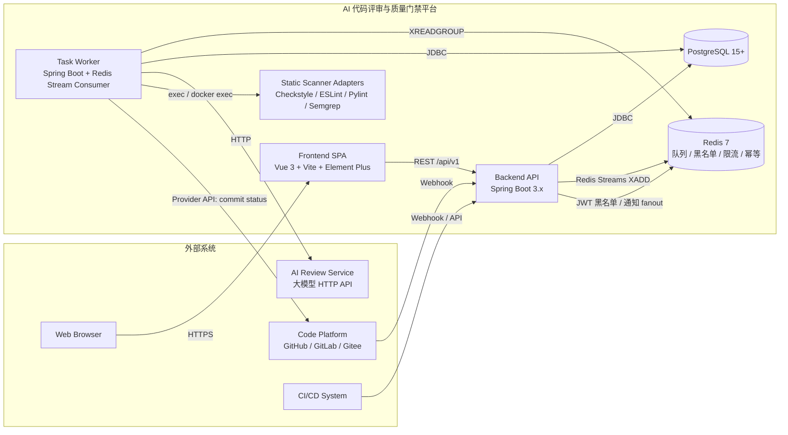

### 2.2 部署架构（开发/默认生产单实例）

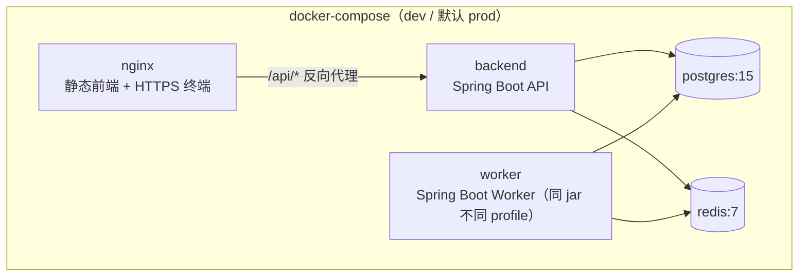

> 单 jar、双 profile（`api` / `worker`）：API 提供 HTTP，Worker 监听 Redis Stream；二者共享同一数据源、同一加密密钥。生产可水平扩展为多 worker 实例（同消费组负载均衡）。

### 2.3 模块依赖图（M01~M10 单向依赖）

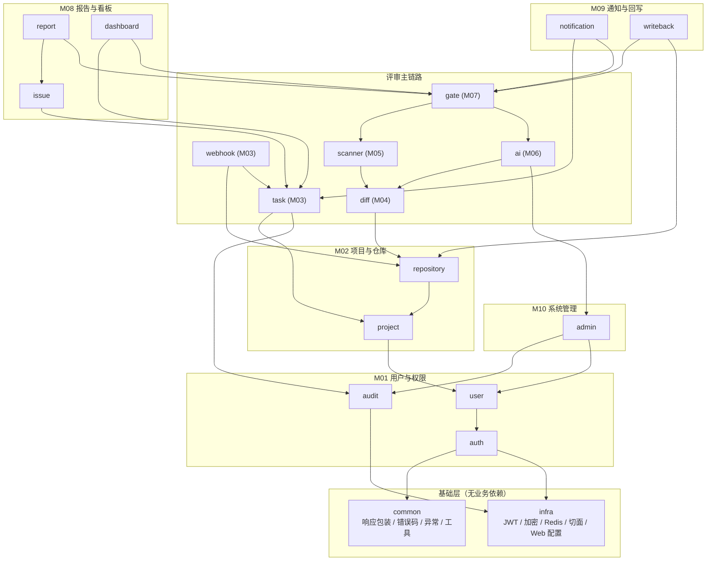

**依赖原则**：

- 依赖方向单向（上→下），不允许反向依赖与循环依赖。
- `common` / `infra` 是基础设施层，所有业务包均可依赖；它们不依赖任何业务包。
- `audit` 通过领域事件（`ApplicationEventPublisher`）被 M02~M10 异步调用，避免硬编码依赖。
- 跨模块同步调用通过显式 Service 接口完成，不允许跨包直接访问对方 Repository。

> Covers: R2, R3, R4, R5, R7, R9, R10, R11, R12, R13, R14, R16, R17, R18, R19, R20, R21, R22, R23, R24

---

## 3. 技术选型与理由（Tech Stack & Rationale）

### 3.1 技术栈锁定

| 维度 | 选型 | 备选方案 | 选定理由（与需求/NFR 对齐） |
|---|---|---|---|
| 后端框架 | **Spring Boot 3.x（Java 17）** | FastAPI / Node.js | 04 号文档示例已用 Java（Checkstyle、JDBC PostgreSQL）；分层、AOP 切面、`@Validated` 完美匹配权限/审计/掩码需求（R2、R22、R23） |
| Web 容器 | 内嵌 Tomcat | Undertow / Netty | Spring Boot 默认；运维成本低 |
| 前端框架 | **Vue 3 + Vite + TypeScript** | React / Angular | 与原型的后台管理风格匹配；TS 强类型适合复杂表单与权限路由 |
| UI 组件 | **Element Plus** | Ant Design Vue | 表格 / 表单 / 抽屉 / 标签 / 卡片 与原型一致 |
| 状态管理 | **Pinia** | Vuex | Vue 3 官方推荐，TS 类型友好 |
| 路由 | **Vue Router 4** | — | 与权限菜单（R2）配合 `meta.requiredRoles` |
| 构建 | Maven（后端）/ npm + Vite（前端） | Gradle / pnpm | Maven 在企业 Java 生态成熟；Vite 启动快、HMR 顺滑 |
| 数据库 | **PostgreSQL 15+** | MySQL 8 | 04 号文档锁定 PostgreSQL；JSONB / GIN 索引 / 部分索引适合 task_log、audit_log（R22、R24） |
| ORM | **MyBatis-Plus 3.5.x** | Spring Data JPA | 复杂分页与多条件查询（R3、R16、R17、R18、R22）写 SQL 更直接；`LambdaQueryWrapper` + 自动分页插件覆盖通用场景；动态 SQL 强于 JPA Specification |
| 缓存 | **Redis 7** | — | 用于 JWT 黑名单（R3.2）、幂等键（R7.4、R8.4）、限流、速率控制 |
| 异步队列 | **Redis Stream + Consumer Group** | RabbitMQ / Kafka | 已部署 Redis，零额外组件；Stream 支持持久化、重放、消费组、ACK；满足 R7.6 / R9 / R24.4。RabbitMQ 在题目场景下属于过度设计 |
| 认证 | **JWT（HS256）+ refreshToken + Redis 黑名单** | Session + Cookie | 无状态可水平扩展；黑名单实现禁用即时失效（R3.2） |
| 密码哈希 | BCrypt（cost=10） | Argon2 | Spring Security 自带 `BCryptPasswordEncoder`，简洁稳健（R1.6） |
| 加密算法 | **AES-GCM-256**（`tokenEncryptionKey`） | AES-CBC | GCM 提供认证加密，防止密文篡改（R5.3、R21.1、R23.2） |
| API 文档 | **springdoc-openapi 2.x** | Swagger 2 | 原生支持 Spring Boot 3 + Jakarta EE；自动从 Bean Validation 生成 schema |
| 验证 | Jakarta Bean Validation 3.0（Hibernate Validator） | 手写校验 | 与 DTO 注解配合（R3、R4、R8、R13、R15、R17） |
| 测试 | **JUnit 5 + Mockito + Spring Boot Test + Testcontainers + jqwik** | TestNG | Testcontainers 提供真实 PostgreSQL/Redis（R25.2）；jqwik 提供属性测试 |
| 前端测试 | **Vitest + @vue/test-utils** | Jest | 与 Vite 同源，启动快 |
| 性能压测 | **k6**（CLI） | JMeter | 脚本即代码，易加入 CI（R16.6 / R18.5 / R24.2） |
| 容器化 | **Docker + docker-compose** | k8s | 课程项目优先轻量；compose 即可覆盖 dev/默认 prod |
| 日志 | **Logback + JSON encoder + traceId（MDC）** | log4j2 | Spring Boot 默认；JSON 便于 ELK 接入（R24.5） |
| 指标 | **Micrometer + Prometheus 端点** | StatsD | Spring Boot Actuator 自带（R24.6） |

### 3.2 选型与需求对照

| 需求 | 关键选型 |
|---|---|
| R1 登录鉴权 | Spring Security + JWT + BCrypt |
| R2 权限控制 | 自定义注解 `@RequirePermission` + AOP + JWT claims |
| R3.2 禁用即时失效 | Redis 黑名单（`jti` set，TTL=accessToken 剩余有效期） |
| R5.3 / R21.1 加密存储 | AES-GCM-256 + `tokenEncryptionKey` |
| R7 Webhook 幂等 + 签名 | HMAC-SHA256 + Redis Set（`(provider, repositoryId, eventId)` TTL=24h） |
| R7.6 异步入队 | Redis Stream `review-task-stream` + Consumer Group `review-worker-group` |
| R9 状态机 | 自实现轻量 State Pattern（不引入 Spring StateMachine 以减少依赖） |
| R12.2 敏感过滤 | Sensitive_Filter + 哈希前后比对 |
| R16.6 / R18.5 性能 | 复合索引 + 必要字段冗余 + 分页限制 |
| R22 审计 immutable | 表无 UPDATE/DELETE 触发器 + 仅追加 SQL |
| R24.6 可观测 | Actuator + Micrometer + JSON Log + traceId |
| R25 PBT | jqwik（Java 属性测试） |

> Covers: R1, R2, R3, R5, R7, R9, R12, R16, R18, R21, R22, R23, R24, R25

---


## 4. 后端分层与目录结构（Backend Layout）

### 4.1 Maven 单模块结构（推荐 MVP，便于按包切分到独立分支）

```
acrqg-platform/
├── pom.xml
├── Dockerfile
├── src/main/java/com/acrqg/platform/
│   ├── AcrqgApplication.java                       # 启动类（profile=api / worker）
│   ├── common/                                     # 通用：响应包装、错误码、异常、工具
│   │   ├── api/{ApiResponse, PageResult, ErrorCode}.java
│   │   ├── exception/{BusinessException, GlobalExceptionHandler}.java
│   │   └── util/{IdGenerator, MaskUtils, JsonUtils}.java
│   ├── infra/                                      # 基础设施：JWT/加密/Redis/切面/Web 配置
│   │   ├── config/{WebMvcConfig, OpenApiConfig, RedisConfig, MyBatisPlusConfig}.java
│   │   ├── security/{JwtAuthFilter, JwtTokenProvider, SecurityConfig}.java
│   │   ├── crypto/{AesGcmCipher, TokenEncryptor}.java
│   │   ├── redis/{RedisStreamPublisher, IdempotencyStore, JwtBlacklist}.java
│   │   ├── permission/{RequirePermission, PermissionAspect, PermissionEvaluator}.java
│   │   └── log/{TraceIdFilter, MaskingLogbackEncoder}.java
│   ├── auth/        # M01：登录、登出、token 刷新
│   ├── user/        # M01：用户列表、状态切换、角色绑定
│   ├── audit/       # M01：审计日志写入与查询（被多模块通过事件调用）
│   ├── project/     # M02：项目 + 成员
│   ├── repository/  # M02：仓库绑定 + 连通性测试 + Provider 客户端工厂
│   ├── webhook/     # M03：Webhook 接收 + 签名校验 + 入队
│   ├── task/        # M03：评审任务 CRUD + Worker 入口 + 状态机
│   ├── diff/        # M04：Diff 拉取与解析
│   ├── scanner/     # M05：扫描器适配层（Strategy）
│   ├── ai/          # M06：AI 评审客户端 + Sensitive_Filter + Schema 校验
│   ├── gate/        # M07：规则引擎 + 指标采集器 + 豁免审批
│   ├── issue/       # M08：问题状态流转
│   ├── report/      # M08：评审报告聚合查询
│   ├── dashboard/   # M08：项目质量看板
│   ├── notification/# M09：站内通知
│   ├── writeback/   # M09：commit status 回写 + 重试
│   └── admin/       # M10：模型 / 扫描器 / 系统参数 / 审计日志查询
├── src/main/resources/
│   ├── application.yml
│   ├── application-api.yml
│   ├── application-worker.yml
│   ├── db/migration/V1__init.sql                  # Flyway / 手动初始化均可
│   └── mapper/*.xml                                # MyBatis 映射
└── src/test/java/com/acrqg/platform/...            # 单元 + 集成 + PBT
```

### 4.2 包到 M01-M10 的映射

| 包 | 模块 | 职责 |
|---|---|---|
| `auth` / `user` / `audit` | **M01** | 登录、用户、角色、权限切面、审计 |
| `project` / `repository` | **M02** | 项目 / 成员 / 仓库绑定 |
| `webhook` / `task` | **M03** | Webhook 接收、任务 CRUD、状态机、Worker |
| `diff` | **M04** | 拉取并解析 Diff |
| `scanner` | **M05** | 静态扫描适配层 |
| `ai` | **M06** | AI 评审客户端 |
| `gate` | **M07** | 门禁规则引擎、判定、豁免 |
| `issue` / `report` / `dashboard` | **M08** | 问题、报告、看板 |
| `notification` / `writeback` | **M09** | 站内通知、状态回写 |
| `admin` | **M10** | 系统管理、模型、扫描器、参数、审计日志 |
| `common` / `infra` | 基础 | 跨模块基础设施 |

### 4.3 包内分层规范

```
com.acrqg.platform.{module}/
  controller/      # @RestController；只做参数校验、权限注解、调用 service
  service/         # 接口
  service/impl/    # 实现：领域逻辑 + 事务（@Transactional）
  repository/      # MyBatis-Plus Mapper / 自定义 SQL
  domain/          # 领域实体（DO，对应表）
  dto/             # 请求 / 响应 DTO
  event/           # ApplicationEvent + Listener（用于跨模块解耦）
  client/          # 外部 HTTP / Process 客户端（如 ProviderClient、ScannerProcess）
```

> Covers: R1, R2, R3, R4, R5, R6, R7, R8, R9, R10, R11, R12, R13, R14, R15, R16, R17, R18, R19, R20, R21, R22

---

## 5. 前端目录结构与路由（Frontend Layout）

### 5.1 目录结构

```
acrqg-web/
├── package.json
├── vite.config.ts
├── tsconfig.json
├── src/
│   ├── api/                          # 与 /api/v1/* 一一对应
│   │   ├── http.ts                   # axios 实例：注入 token、刷新、错误码处理
│   │   ├── auth.ts
│   │   ├── user.ts
│   │   ├── project.ts
│   │   ├── repository.ts
│   │   ├── reviewTask.ts
│   │   ├── issue.ts
│   │   ├── report.ts
│   │   ├── gate.ts
│   │   ├── dashboard.ts
│   │   ├── notification.ts
│   │   └── admin.ts
│   ├── components/                   # 通用组件
│   │   ├── PageContainer.vue
│   │   ├── DataTable.vue
│   │   ├── SeverityTag.vue
│   │   ├── StatusTag.vue
│   │   ├── DiffViewer.vue            # 代码差异 + 行级问题标注
│   │   └── PermissionGuard.vue
│   ├── layouts/
│   │   ├── DefaultLayout.vue         # header + sidebar + main
│   │   └── BlankLayout.vue           # 登录页等
│   ├── pages/
│   │   ├── login/LoginPage.vue                    # UI-001
│   │   ├── dashboard/DashboardPage.vue            # UI-002
│   │   ├── project/{ProjectListPage, ProjectDetailPage,
│   │   │              RepositoryBindingPage,
│   │   │              MemberManagePage, QualityGatePage}.vue   # UI-003 / 004 / 005 / 009
│   │   ├── reviewTask/{ReviewTaskListPage,
│   │   │                ReviewReportPage,
│   │   │                CreateTaskDialog}.vue     # UI-006 / 007
│   │   ├── issue/IssueDetailDrawer.vue            # UI-008
│   │   ├── notification/NotificationListPage.vue
│   │   └── admin/{UserManagePage, ModelConfigPage,
│   │              ScannerConfigPage, AuditLogPage}.vue        # UI-010
│   ├── router/
│   │   ├── index.ts                  # 路由表 + meta.requiredRoles
│   │   └── guards.ts                 # beforeEach：登录、权限
│   ├── stores/                       # Pinia
│   │   ├── auth.ts                   # 当前用户、token、roles
│   │   ├── project.ts                # 当前项目上下文
│   │   ├── reviewTask.ts             # 任务列表筛选条件 + 分页
│   │   ├── issue.ts                  # 问题筛选条件 + 状态变更
│   │   ├── gate.ts                   # 门禁规则草稿
│   │   ├── notification.ts           # 未读数 + 列表
│   │   └── admin.ts
│   ├── types/                        # 与后端 DTO 对齐
│   │   └── api.d.ts
│   ├── utils/{format, permission, severity}.ts
│   ├── App.vue
│   └── main.ts
└── public/
```

### 5.2 路由表（与原型 UI-001 ~ UI-010 对应）

| 路由 | 页面 | 原型 | 必需角色（meta.requiredRoles） |
|---|---|---|---|
| `/login` | LoginPage | UI-001 | 公开 |
| `/dashboard` | DashboardPage | UI-002 | 任意已登录 |
| `/projects` | ProjectListPage | UI-003 | 任意已登录 |
| `/projects/:projectId` | ProjectDetailPage | UI-004 | 项目成员 |
| `/projects/:projectId/repository` | RepositoryBindingPage | UI-005 | PROJECT_ADMIN |
| `/projects/:projectId/members` | MemberManagePage | UI-004 | PROJECT_ADMIN |
| `/projects/:projectId/quality-gate` | QualityGatePage | UI-009 | PROJECT_ADMIN |
| `/review-tasks` | ReviewTaskListPage | UI-006 | 任意已登录 |
| `/review-tasks/:taskId/report` | ReviewReportPage | UI-007 | 项目成员 |
| `/issues/:issueId` | IssueDetailDrawer（在报告页内打开） | UI-008 | 项目成员 |
| `/notifications` | NotificationListPage | — | 任意已登录 |
| `/admin/users` | UserManagePage | UI-010 | SYSTEM_ADMIN |
| `/admin/model-configs` | ModelConfigPage | UI-010 | SYSTEM_ADMIN |
| `/admin/scanners` | ScannerConfigPage | UI-010 | SYSTEM_ADMIN |
| `/admin/audit-logs` | AuditLogPage | UI-010 | SYSTEM_ADMIN |

### 5.3 状态管理切片划分（Pinia stores）

| Store | 职责 | 关键 state |
|---|---|---|
| `auth` | 登录态、当前用户、roles、token 刷新 | `user`、`accessToken`、`refreshToken`、`expiresAt` |
| `project` | 当前项目上下文（顶部项目切换器） | `currentProject`、`memberRole` |
| `reviewTask` | 列表筛选条件、分页、最近创建 | `filters`、`page`、`items` |
| `issue` | 当前任务问题筛选与抽屉状态 | `filters`、`activeIssue` |
| `gate` | 门禁规则编辑草稿 | `draftRules`、`dirty` |
| `notification` | 未读数轮询、最新通知 | `unreadCount`、`items` |
| `admin` | 模型 / 扫描器 / 系统参数 | `models`、`scanners`、`params` |

### 5.4 路由守卫与权限

```ts
// router/guards.ts（伪代码）
router.beforeEach((to) => {
  if (to.meta.public) return true
  const auth = useAuthStore()
  if (!auth.accessToken) return { name: 'login', query: { redirect: to.fullPath } }
  const required = (to.meta.requiredRoles ?? []) as Role[]
  if (required.length && !required.some(r => auth.user.roles.includes(r))) {
    return { name: 'forbidden' }
  }
})
```

> Covers: R1, R2, R3, R4, R5, R6, R7, R8, R13, R15, R16, R17, R18, R19, R21

---

## 6. 核心组件与接口（Components & Interfaces）

> 本节给出每个 Service 的关键 Java 接口签名（接口 + 关键方法 + JavaDoc 摘要）。所有方法的入参/返回详见第 8 节 DTO 定义。

### 6.1 认证与用户（auth / user）

```java
package com.acrqg.platform.auth.service;

public interface AuthService {
    /** 用户名密码登录，签发 access + refresh token。R1.1/1.2/1.3 */
    LoginResultDTO login(LoginRequest req);

    /** 注销：将当前 jti 加入 Redis 黑名单（TTL=token 剩余有效期）。R1.6 / R3.2 */
    void logout(String accessToken);

    /** 刷新 access token。R1.5 */
    RefreshResultDTO refresh(String refreshToken);

    /** 获取当前用户。R1 */
    UserDTO me();
}
```

```java
package com.acrqg.platform.user.service;

public interface UserService {
    /** R3.1 关键字 + status + role 分页查询 */
    PageResult<UserDTO> page(UserQuery q);

    /** R3.2 切换状态；status=DISABLED 时立即将该用户所有 jti 加入黑名单 */
    UserDTO changeStatus(Long id, UserStatus status);

    /** R3.4 唯一性校验（username / email） */
    UserDTO create(UserCreateRequest req);
}
```

### 6.2 项目与仓库（project / repository）

```java
public interface ProjectService {
    /** R4.1 创建；R4.2 校验 name 唯一；R4.5 写审计 */
    ProjectDTO create(ProjectCreateRequest req);
    PageResult<ProjectDTO> page(ProjectQuery q);
    ProjectDTO get(Long projectId);
    ProjectDTO update(Long projectId, ProjectUpdateRequest req);

    /** R6 成员管理 */
    void addMember(Long projectId, Long userId, ProjectRole role);
    void removeMember(Long projectId, Long userId);
    boolean isMember(Long projectId, Long userId);
    Optional<ProjectRole> roleOf(Long projectId, Long userId);
}
```

```java
public interface RepositoryService {
    /** R5.1 测试连通性（不持久化），返回 reachable + message */
    ConnectivityResultDTO test(Long projectId, RepositoryTestRequest req);

    /** R5.3 / R5.4 加密存储；R5.5 生成 webhook url；R5.6 唯一约束 */
    RepositoryBindingDTO bind(Long projectId, RepositoryBindRequest req);

    RepositoryBindingDTO get(Long projectId);

    /** 内部使用：解密 accessToken 用于 Diff 拉取与状态回写 */
    String decryptAccessToken(Long projectId);
    String decryptWebhookSecret(Long projectId);
}
```

### 6.3 Webhook 与评审任务（webhook / task）

```java
public interface WebhookService {
    /**
     * R7.1 签名校验、R7.4 幂等；调用 ReviewTaskService 创建任务后通过 RedisStreamPublisher 入队。
     * 必须在 3 秒内同步返回（R7.6）。
     */
    WebhookHandleResultDTO handle(String provider, HttpHeaders headers, String rawBody);
}

public interface ReviewTaskService {
    /** R8 手动创建，幂等键支持 Idempotency-Key 与 (projectId, prId, commitSha) 双重去重 */
    ReviewTaskDTO create(ReviewTaskCreateRequest req, String idempotencyKey, TriggerType trigger);

    PageResult<ReviewTaskDTO> page(ReviewTaskQuery q);
    ReviewTaskDTO get(Long id);

    /** R9.4 重试：仅终态可触发 */
    ReviewTaskDTO retry(Long id, String reason);

    /** R9.6 取消：仅 PENDING 可触发 */
    ReviewTaskDTO cancel(Long id, String reason);

    /** R9.3 状态字典合法迁移；非法迁移抛 BusinessException */
    void transitTo(Long id, ReviewTaskStatus target);
}
```

#### 6.3.1 Task_Worker 状态机

采用**自实现轻量 State Pattern**，每个状态对应一个 `TaskStage` 实现，避免引入 Spring StateMachine 的额外学习成本。

```java
public interface TaskStage {
    ReviewTaskStatus stage();              // 当前阶段标识
    ReviewTaskStatus next(StageContext ctx);  // 执行后返回下一状态（终态返回自身）
    long timeoutSeconds();                 // 阶段超时（默认从系统参数读取）
}

@Component
public class FetchingDiffStage implements TaskStage { /* R10 */ }
@Component
public class StaticScanningStage implements TaskStage { /* R11 */ }
@Component
public class AiReviewingStage implements TaskStage { /* R12 */ }
@Component
public class GateEvaluatingStage implements TaskStage { /* R14 */ }

@Service
public class TaskOrchestrator {
    /** 串行驱动：从 PENDING 起，顺序执行各阶段直到终态；任何阶段抛异常或超时 -> EXECUTION_FAILED（R9.2） */
    public void run(Long taskId) { ... }
}
```

合法状态迁移图（R9.1 / R9.3）：

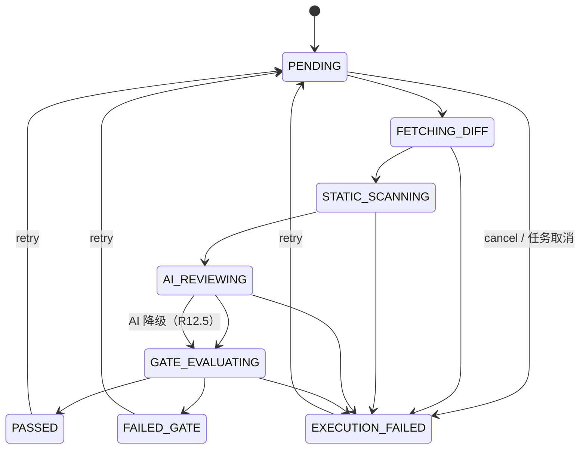

#### 6.3.2 异步任务消费模型（Redis Stream）

- Stream key：`review-task-stream`
- Consumer Group：`review-worker-group`
- 消费者 ID：`worker-${HOSTNAME}-${PID}`
- 消息体：`{ taskId, projectId, attempt, enqueuedAt }`
- 拉取：`XREADGROUP GROUP review-worker-group <consumer> COUNT N BLOCK 5000 STREAMS review-task-stream >`
- ACK：业务流程结束后 `XACK`；超时未 ACK 的消息可由 `XCLAIM` 转移给其他消费者，实现"中断恢复"（R24.4）。
- 并发：`review.worker.concurrency`（R21.4 / R24.3）控制每个 JVM 内的消费者线程数，60 秒内热更新（监听 Redis pub/sub `param-changed`）。

```java
public interface RedisStreamPublisher {
    String enqueue(ReviewTaskMessage msg);   // 返回 streamId
}

@Component
public class ReviewTaskConsumer {
    @Scheduled(fixedDelay = 0) // 阻塞拉取
    public void pollAndDispatch() { ... }
}
```

### 6.4 代码差异解析（diff）

```java
public interface DiffParser {
    /** R10.1~R10.5：拉取 + 解析；oversized 文件标记跳过 AI */
    DiffParseResult parse(Long taskId);
}

public record DiffParseResult(
    int changedFileCount,
    long totalAddedLines,
    long totalDeletedLines,
    List<ChangedFile> files
) { }

public record ChangedFile(
    String filePath,
    ChangeType changeType,        // ADDED / MODIFIED / DELETED
    int addedLines,
    int deletedLines,
    int totalChangedLines,
    boolean oversized,
    List<DiffHunk> hunks
) { }
```

### 6.5 静态扫描适配层（scanner）

```java
public interface StaticScannerAdapter {
    String name();                                // checkstyle / eslint / pylint / semgrep
    Set<String> supportedLanguages();
    boolean isAvailable();                        // R11.4 探测可用性
    List<CodeIssue> scan(ScanContext ctx);        // R11.2 转换为统一 CodeIssue
}

public interface ScannerOrchestrator {
    /** R11.5 仅扫描变更文件；多扫描器并行；任一失败不影响其他（R11.4） */
    List<CodeIssue> scan(Long taskId);
}
```

### 6.6 AI 评审客户端（ai）

```java
public interface AiReviewClient {
    AiReviewResponse review(AiReviewRequest req);     // 包含超时控制
}

public interface SensitiveFilter {
    /**
     * R12.2 / R23.4 路径白名单 + Token 正则 + 哈希前后比对。
     * 命中过滤规则但 hash 未变化时抛 SensitiveFilterFailureException（R12.2 中止 AI 调用）。
     */
    FilteredPayload filter(AiReviewPayload raw);
}

public interface AiReviewService {
    /** R12.1~R12.6：含降级、Schema 校验、ai_risk_score 计算 */
    AiReviewOutcome execute(Long taskId);
}
```

### 6.7 质量门禁（gate）

```java
public interface MetricCollector<T extends Number> {
    String metric();                              // critical_issue_count 等
    T collect(Long taskId, MetricContext ctx);
}

public interface OperatorEvaluator {
    boolean compare(Number actual, String operator, String threshold);
}

public interface GateRuleEngine {
    /** R14.1~R14.5：聚合所有启用规则，输出 GateResult */
    GateResult evaluate(Long taskId);
}

public interface QualityGateService {
    QualityGateDTO save(Long projectId, QualityGateSaveRequest req);    // R13
    QualityGateDTO getEnabled(Long projectId);
}

public interface GateWaiverService {
    GateWaiverDTO submit(Long taskId, GateWaiverSubmitRequest req);     // R15.1/15.2/15.6
    GateWaiverDTO approve(Long waiverId, GateWaiverApproveRequest req); // R15.3/15.4/15.5
}
```

### 6.8 问题与报告（issue / report / dashboard）

```java
public interface IssueService {
    PageResult<CodeIssueDTO> page(IssueQuery q);                        // R16.2/16.3
    CodeIssueDTO get(Long id);
    CodeIssueDTO changeStatus(Long id, IssueStatusChangeRequest req);   // R17
    IssueCommentDTO addComment(Long id, String content);
}

public interface ReportService {
    ReviewReportDTO report(Long taskId);                                // R16.1
    DiffViewDTO diffView(Long taskId);                                  // R16.4
    PageResult<TaskLogDTO> logs(Long taskId, TaskLogQuery q);           // R16.5 / R9.7
}

public interface DashboardService {
    QualityTrendDTO trend(Long projectId, DashboardQuery q);            // R18.1
    List<RiskFileDTO> topRiskFiles(Long projectId, int topN);           // R18.3
}
```

### 6.9 通知与回写（notification / writeback）

```java
public interface NotificationService {
    void publishTaskStatusChanged(ReviewTask task);                     // R19.1
    void publishGateWaiverSubmitted(GateWaiver waiver);                 // R19.2
    PageResult<NotificationDTO> page(NotificationQuery q);              // R19.3
    void markRead(Long id);                                             // R19.4
}

public interface WritebackService {
    /** R14.6 / R20：通过 ProviderClient 回写 commit status；指数退避重试 */
    WritebackResult writeback(Long taskId, GateResult result);
}

public interface ProviderClient {
    String name();                                                       // GITHUB / GITLAB / GITEE
    void postCommitStatus(CommitStatusRequest req);                     // R20.1/20.2
    DiffPayload fetchDiff(DiffFetchRequest req);                         // R10.1
    boolean ping(RepositoryTestRequest req);                            // R5.1
}
```

### 6.10 系统管理与审计（admin / audit）

```java
public interface AdminService {
    ModelConfigDTO createModel(ModelConfigCreateRequest req);           // R21.1
    List<ModelConfigDTO> listModels();                                  // R21.2 掩码返回
    ScannerConfigDTO upsertScanner(ScannerConfigRequest req);           // R21.3
    void updateSystemParam(String key, String value);                   // R21.4
}

public interface AuditService {
    void record(AuditEvent event);                                      // R22 仅追加；通过 ApplicationEvent 异步消费
    PageResult<AuditLogDTO> page(AuditQuery q);                         // R22.2
}
```

> Covers: R1, R3, R4, R5, R6, R7, R8, R9, R10, R11, R12, R13, R14, R15, R16, R17, R18, R19, R20, R21, R22

---

## 7. 数据模型（Data Model）

> 在 04 号文档列出的 13 张表基础上补全字段类型、长度、非空、默认值、`updated_at`、必要的辅助表（如 `gate_result`、`gate_waiver`、`issue_history`、`scanner_config`、`model_config`、`system_param`、`role`、`user_role` 等）。

### 7.1 ER 图

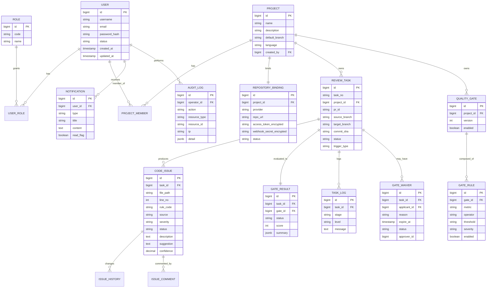

### 7.2 完整 PostgreSQL DDL

```sql
-- =========================================================
-- 0. 通用：使用 BIGSERIAL 自增主键；时间戳统一 TIMESTAMPTZ
-- =========================================================
SET TIME ZONE 'Asia/Shanghai';

-- =========================================================
-- M01 用户与权限
-- =========================================================
CREATE TABLE "user" (
    id              BIGSERIAL PRIMARY KEY,
    username        VARCHAR(64)   NOT NULL,
    email           VARCHAR(128)  NOT NULL,
    password_hash   VARCHAR(120)  NOT NULL,             -- BCrypt 60 字符；保留余量
    status          VARCHAR(16)   NOT NULL DEFAULT 'ENABLED' CHECK (status IN ('ENABLED','DISABLED')),
    created_at      TIMESTAMPTZ   NOT NULL DEFAULT NOW(),
    updated_at      TIMESTAMPTZ   NOT NULL DEFAULT NOW(),
    CONSTRAINT uk_user_username UNIQUE (username),
    CONSTRAINT uk_user_email    UNIQUE (email)
);

CREATE TABLE role (
    id          BIGSERIAL PRIMARY KEY,
    code        VARCHAR(32)   NOT NULL,                 -- DEVELOPER / REVIEWER / PROJECT_ADMIN / SYSTEM_ADMIN / CI_CD
    name        VARCHAR(64)   NOT NULL,
    description VARCHAR(255),
    CONSTRAINT uk_role_code UNIQUE (code)
);

CREATE TABLE user_role (
    id      BIGSERIAL PRIMARY KEY,
    user_id BIGINT NOT NULL REFERENCES "user"(id) ON DELETE CASCADE,
    role_id BIGINT NOT NULL REFERENCES role(id),
    CONSTRAINT uk_user_role UNIQUE (user_id, role_id)
);
CREATE INDEX idx_user_role_user ON user_role(user_id);
CREATE INDEX idx_user_role_role ON user_role(role_id);

-- =========================================================
-- M02 项目与仓库
-- =========================================================
CREATE TABLE project (
    id              BIGSERIAL PRIMARY KEY,
    name            VARCHAR(128)  NOT NULL,
    description     VARCHAR(512),
    default_branch  VARCHAR(128)  NOT NULL DEFAULT 'main',
    language        VARCHAR(32)   NOT NULL,             -- Java / Python / JavaScript / TypeScript / Go ...
    created_by      BIGINT        NOT NULL REFERENCES "user"(id),
    created_at      TIMESTAMPTZ   NOT NULL DEFAULT NOW(),
    updated_at      TIMESTAMPTZ   NOT NULL DEFAULT NOW(),
    CONSTRAINT uk_project_name UNIQUE (name)            -- R4.2 组织内唯一
);
CREATE INDEX idx_project_created_by ON project(created_by);

CREATE TABLE project_member (
    id           BIGSERIAL PRIMARY KEY,
    project_id   BIGINT      NOT NULL REFERENCES project(id) ON DELETE CASCADE,
    user_id      BIGINT      NOT NULL REFERENCES "user"(id),
    project_role VARCHAR(32) NOT NULL CHECK (project_role IN ('DEVELOPER','REVIEWER','PROJECT_ADMIN')),
    joined_at    TIMESTAMPTZ NOT NULL DEFAULT NOW(),
    CONSTRAINT uk_project_member UNIQUE (project_id, user_id) -- R6.1
);
CREATE INDEX idx_project_member_user ON project_member(user_id);

CREATE TABLE repository_binding (
    id                       BIGSERIAL PRIMARY KEY,
    project_id               BIGINT       NOT NULL REFERENCES project(id) ON DELETE CASCADE,
    provider                 VARCHAR(16)  NOT NULL CHECK (provider IN ('GITHUB','GITLAB','GITEE')),
    repo_url                 VARCHAR(512) NOT NULL,
    access_token_encrypted   VARCHAR(1024) NOT NULL,    -- AES-GCM 密文 base64
    webhook_secret_encrypted VARCHAR(1024) NOT NULL,
    webhook_url              VARCHAR(512) NOT NULL,
    status                   VARCHAR(16)  NOT NULL DEFAULT 'ACTIVE' CHECK (status IN ('ACTIVE','INACTIVE')),
    last_checked_at          TIMESTAMPTZ,
    created_at               TIMESTAMPTZ  NOT NULL DEFAULT NOW(),
    updated_at               TIMESTAMPTZ  NOT NULL DEFAULT NOW(),
    CONSTRAINT uk_repository_binding_project UNIQUE (project_id) -- R5.6 一项目一绑定
);

-- =========================================================
-- M03 评审任务 + 任务日志
-- =========================================================
CREATE TABLE review_task (
    id            BIGSERIAL PRIMARY KEY,
    task_no       VARCHAR(64)   NOT NULL,               -- 形如 RT20260519001
    project_id    BIGINT        NOT NULL REFERENCES project(id),
    pr_id         VARCHAR(64),
    source_branch VARCHAR(128),
    target_branch VARCHAR(128),
    commit_sha    VARCHAR(128)  NOT NULL,
    status        VARCHAR(32)   NOT NULL CHECK (status IN
        ('PENDING','FETCHING_DIFF','STATIC_SCANNING','AI_REVIEWING',
         'GATE_EVALUATING','PASSED','FAILED_GATE','EXECUTION_FAILED')),
    trigger_type  VARCHAR(16)   NOT NULL CHECK (trigger_type IN ('WEBHOOK','MANUAL','CI_CD','RETRY')),
    triggered_by  BIGINT REFERENCES "user"(id),
    started_at    TIMESTAMPTZ,
    finished_at   TIMESTAMPTZ,
    score         INT CHECK (score BETWEEN 0 AND 100),
    ai_available  BOOLEAN       NOT NULL DEFAULT TRUE,
    created_at    TIMESTAMPTZ   NOT NULL DEFAULT NOW(),
    updated_at    TIMESTAMPTZ   NOT NULL DEFAULT NOW(),
    CONSTRAINT uk_review_task_no UNIQUE (task_no),
    CONSTRAINT uk_review_task_triple UNIQUE (project_id, pr_id, commit_sha) -- R7.4 / R8.3 幂等
);
CREATE INDEX idx_review_task_status      ON review_task(status);
CREATE INDEX idx_review_task_project_ts  ON review_task(project_id, created_at DESC);
CREATE INDEX idx_review_task_finished_at ON review_task(finished_at);

CREATE TABLE task_log (
    id         BIGSERIAL PRIMARY KEY,
    task_id    BIGINT       NOT NULL REFERENCES review_task(id) ON DELETE CASCADE,
    stage      VARCHAR(32)  NOT NULL,
    level      VARCHAR(8)   NOT NULL CHECK (level IN ('INFO','WARN','ERROR')),
    message    TEXT         NOT NULL,
    detail     JSONB,
    created_at TIMESTAMPTZ  NOT NULL DEFAULT NOW()
);
CREATE INDEX idx_task_log_task_stage_time ON task_log(task_id, stage, created_at DESC);

CREATE TABLE diff_file (
    id                  BIGSERIAL PRIMARY KEY,
    task_id             BIGINT       NOT NULL REFERENCES review_task(id) ON DELETE CASCADE,
    file_path           VARCHAR(512) NOT NULL,
    change_type         VARCHAR(16)  NOT NULL CHECK (change_type IN ('ADDED','MODIFIED','DELETED')),
    added_lines         INT          NOT NULL DEFAULT 0,
    deleted_lines       INT          NOT NULL DEFAULT 0,
    total_changed_lines INT          NOT NULL DEFAULT 0,
    oversized           BOOLEAN      NOT NULL DEFAULT FALSE,
    diff_payload        JSONB        NOT NULL,           -- hunks 列表
    created_at          TIMESTAMPTZ  NOT NULL DEFAULT NOW(),
    CONSTRAINT uk_diff_file_task_path UNIQUE (task_id, file_path)
);
CREATE INDEX idx_diff_file_task ON diff_file(task_id);

-- =========================================================
-- M05 / M06 问题
-- =========================================================
CREATE TABLE code_issue (
    id          BIGSERIAL PRIMARY KEY,
    task_id     BIGINT        NOT NULL REFERENCES review_task(id) ON DELETE CASCADE,
    file_path   VARCHAR(512)  NOT NULL,
    line_no     INT,
    rule_code   VARCHAR(128),
    source      VARCHAR(16)   NOT NULL CHECK (source IN ('SAST','AI','MANUAL')),
    severity    VARCHAR(16)   NOT NULL CHECK (severity IN ('CRITICAL','HIGH','MEDIUM','LOW','INFO')),
    status      VARCHAR(16)   NOT NULL DEFAULT 'NEW'
                CHECK (status IN ('NEW','CONFIRMED','FALSE_POSITIVE','PENDING_VERIFY','CLOSED','REOPENED')),
    description TEXT          NOT NULL,
    suggestion  TEXT,
    confidence  NUMERIC(5,4) CHECK (confidence IS NULL OR (confidence >= 0 AND confidence <= 1)),
    created_at  TIMESTAMPTZ   NOT NULL DEFAULT NOW(),
    updated_at  TIMESTAMPTZ   NOT NULL DEFAULT NOW()
);
CREATE INDEX idx_code_issue_task                  ON code_issue(task_id);
CREATE INDEX idx_code_issue_severity_status       ON code_issue(severity, status);
CREATE INDEX idx_code_issue_task_severity_source  ON code_issue(task_id, severity, source);
CREATE INDEX idx_code_issue_file                  ON code_issue(task_id, file_path);

CREATE TABLE issue_history (
    id          BIGSERIAL PRIMARY KEY,
    issue_id    BIGINT       NOT NULL REFERENCES code_issue(id) ON DELETE CASCADE,
    from_status VARCHAR(16)  NOT NULL,
    to_status   VARCHAR(16)  NOT NULL,
    operator_id BIGINT       NOT NULL REFERENCES "user"(id),
    comment     VARCHAR(1024),
    changed_at  TIMESTAMPTZ  NOT NULL DEFAULT NOW()
);
CREATE INDEX idx_issue_history_issue ON issue_history(issue_id, changed_at DESC);

CREATE TABLE issue_comment (
    id          BIGSERIAL PRIMARY KEY,
    issue_id    BIGINT       NOT NULL REFERENCES code_issue(id) ON DELETE CASCADE,
    user_id     BIGINT       NOT NULL REFERENCES "user"(id),
    content     TEXT         NOT NULL,
    created_at  TIMESTAMPTZ  NOT NULL DEFAULT NOW()
);
CREATE INDEX idx_issue_comment_issue ON issue_comment(issue_id, created_at DESC);

-- =========================================================
-- M07 质量门禁
-- =========================================================
CREATE TABLE quality_gate (
    id         BIGSERIAL PRIMARY KEY,
    project_id BIGINT       NOT NULL REFERENCES project(id) ON DELETE CASCADE,
    name       VARCHAR(128) NOT NULL,
    version    INT          NOT NULL,                   -- R13.4 历史版本
    enabled    BOOLEAN      NOT NULL DEFAULT TRUE,
    created_by BIGINT       NOT NULL REFERENCES "user"(id),
    created_at TIMESTAMPTZ  NOT NULL DEFAULT NOW(),
    CONSTRAINT uk_gate_project_version UNIQUE (project_id, version)
);
CREATE INDEX idx_quality_gate_project ON quality_gate(project_id);

-- 同一项目同一时刻只能一个 enabled=true（R13.4）：使用 partial unique index
CREATE UNIQUE INDEX uk_quality_gate_one_enabled
    ON quality_gate(project_id) WHERE enabled = TRUE;

CREATE TABLE gate_rule (
    id        BIGSERIAL PRIMARY KEY,
    gate_id   BIGINT       NOT NULL REFERENCES quality_gate(id) ON DELETE CASCADE,
    metric    VARCHAR(64)  NOT NULL CHECK (metric IN
              ('critical_issue_count','security_issue_count','test_coverage',
               'duplicate_rate','ai_risk_score','new_issue_count')),
    operator  VARCHAR(4)   NOT NULL CHECK (operator IN ('<=','>=','<','>','==','!=')),
    threshold VARCHAR(32)  NOT NULL,
    severity  VARCHAR(8)   NOT NULL CHECK (severity IN ('BLOCKER','WARN')),
    enabled   BOOLEAN      NOT NULL DEFAULT TRUE,
    sort_order INT          NOT NULL DEFAULT 0
);
CREATE INDEX idx_gate_rule_gate ON gate_rule(gate_id);

CREATE TABLE gate_result (
    id           BIGSERIAL PRIMARY KEY,
    task_id      BIGINT       NOT NULL REFERENCES review_task(id) ON DELETE CASCADE,
    gate_id      BIGINT       NOT NULL REFERENCES quality_gate(id),
    status       VARCHAR(16)  NOT NULL CHECK (status IN ('PENDING','PASSED','FAILED','WAIVED')),
    score        INT          NOT NULL DEFAULT 0,
    summary      JSONB        NOT NULL,                  -- failedRules / passedRules / aiAvailable
    evaluated_at TIMESTAMPTZ  NOT NULL DEFAULT NOW(),
    CONSTRAINT uk_gate_result_task UNIQUE (task_id)
);
CREATE INDEX idx_gate_result_status ON gate_result(status);

CREATE TABLE gate_waiver (
    id           BIGSERIAL PRIMARY KEY,
    task_id      BIGINT       NOT NULL REFERENCES review_task(id) ON DELETE CASCADE,
    applicant_id BIGINT       NOT NULL REFERENCES "user"(id),
    reason       VARCHAR(1024) NOT NULL,
    expire_at    TIMESTAMPTZ  NOT NULL,
    status       VARCHAR(16)  NOT NULL DEFAULT 'PENDING'
                 CHECK (status IN ('PENDING','APPROVED','REJECTED','EXPIRED')),
    approver_id  BIGINT REFERENCES "user"(id),
    approver_comment VARCHAR(1024),
    approved_at  TIMESTAMPTZ,
    created_at   TIMESTAMPTZ  NOT NULL DEFAULT NOW()
);
CREATE INDEX idx_gate_waiver_task ON gate_waiver(task_id, created_at DESC);
-- R15.6：同一任务只能有一个 PENDING 或未过期 APPROVED 的 waiver
CREATE UNIQUE INDEX uk_gate_waiver_active
    ON gate_waiver(task_id) WHERE status IN ('PENDING','APPROVED');

-- =========================================================
-- M09 通知
-- =========================================================
CREATE TABLE notification (
    id         BIGSERIAL PRIMARY KEY,
    user_id    BIGINT       NOT NULL REFERENCES "user"(id) ON DELETE CASCADE,
    type       VARCHAR(32)  NOT NULL,                    -- TASK_PASSED / TASK_FAILED / TASK_EXEC_FAILED / WAIVER_SUBMITTED ...
    title      VARCHAR(255) NOT NULL,
    content    TEXT         NOT NULL,
    ref_type   VARCHAR(32),                              -- REVIEW_TASK / GATE_WAIVER ...
    ref_id     BIGINT,
    read_flag  BOOLEAN      NOT NULL DEFAULT FALSE,
    created_at TIMESTAMPTZ  NOT NULL DEFAULT NOW()
);
CREATE INDEX idx_notification_user_read ON notification(user_id, read_flag, created_at DESC);

-- =========================================================
-- M10 系统管理 + 审计
-- =========================================================
CREATE TABLE model_config (
    id                  BIGSERIAL PRIMARY KEY,
    name                VARCHAR(64)  NOT NULL,
    base_url            VARCHAR(255) NOT NULL,
    api_key_encrypted   VARCHAR(1024) NOT NULL,
    timeout_seconds     INT          NOT NULL DEFAULT 60 CHECK (timeout_seconds BETWEEN 10 AND 300),
    enabled             BOOLEAN      NOT NULL DEFAULT TRUE,
    created_at          TIMESTAMPTZ  NOT NULL DEFAULT NOW(),
    updated_at          TIMESTAMPTZ  NOT NULL DEFAULT NOW(),
    CONSTRAINT uk_model_name UNIQUE (name)
);

CREATE TABLE scanner_config (
    id                 BIGSERIAL PRIMARY KEY,
    name               VARCHAR(64)  NOT NULL,
    language           VARCHAR(32)  NOT NULL,
    enabled            BOOLEAN      NOT NULL DEFAULT TRUE,
    command            VARCHAR(1024) NOT NULL,
    result_parser_type VARCHAR(32)  NOT NULL,            -- CHECKSTYLE_XML / ESLINT_JSON / PYLINT_JSON / SEMGREP_JSON
    created_at         TIMESTAMPTZ  NOT NULL DEFAULT NOW(),
    updated_at         TIMESTAMPTZ  NOT NULL DEFAULT NOW(),
    CONSTRAINT uk_scanner_name UNIQUE (name)
);

CREATE TABLE system_param (
    id          BIGSERIAL PRIMARY KEY,
    param_key   VARCHAR(128) NOT NULL,
    param_value VARCHAR(1024) NOT NULL,
    description VARCHAR(255),
    sensitive   BOOLEAN      NOT NULL DEFAULT FALSE,
    updated_by  BIGINT REFERENCES "user"(id),
    updated_at  TIMESTAMPTZ  NOT NULL DEFAULT NOW(),
    CONSTRAINT uk_system_param_key UNIQUE (param_key)
);

CREATE TABLE audit_log (
    id                 BIGSERIAL PRIMARY KEY,
    operator_id        BIGINT REFERENCES "user"(id),
    operator_username  VARCHAR(64),
    action             VARCHAR(64)  NOT NULL,
    resource_type      VARCHAR(64),
    resource_id        VARCHAR(64),
    ip                 VARCHAR(45),
    detail             JSONB,                            -- 已掩码后的明细（R22.5）
    created_at         TIMESTAMPTZ  NOT NULL DEFAULT NOW()
);
CREATE INDEX idx_audit_operator_action_time ON audit_log(operator_id, action, created_at DESC);
CREATE INDEX idx_audit_action_time          ON audit_log(action, created_at DESC);

-- R22.4：审计日志只追加；通过触发器禁止 UPDATE / DELETE
CREATE OR REPLACE FUNCTION reject_audit_modify() RETURNS trigger AS $$
BEGIN
  RAISE EXCEPTION 'audit_log is append-only';
END;
$$ LANGUAGE plpgsql;
CREATE TRIGGER trg_audit_no_update BEFORE UPDATE ON audit_log
  FOR EACH ROW EXECUTE FUNCTION reject_audit_modify();
CREATE TRIGGER trg_audit_no_delete BEFORE DELETE ON audit_log
  FOR EACH ROW EXECUTE FUNCTION reject_audit_modify();

-- =========================================================
-- 自动 updated_at
-- =========================================================
CREATE OR REPLACE FUNCTION touch_updated_at() RETURNS trigger AS $$
BEGIN NEW.updated_at = NOW(); RETURN NEW; END;
$$ LANGUAGE plpgsql;

DO $$
DECLARE t TEXT;
BEGIN
  FOR t IN SELECT unnest(ARRAY['"user"','project','repository_binding','review_task',
                                'code_issue','model_config','scanner_config'])
  LOOP
    EXECUTE format('CREATE TRIGGER trg_%I_updated BEFORE UPDATE ON %s
                    FOR EACH ROW EXECUTE FUNCTION touch_updated_at()',
                   replace(t,'"',''), t);
  END LOOP;
END$$;
```

### 7.3 关键查询的索引设计依据

| 查询场景 | 关键 SQL 模式 | 索引 |
|---|---|---|
| 评审任务列表（按项目 + 时间倒序）R16 | `WHERE project_id=? ORDER BY created_at DESC LIMIT N` | `idx_review_task_project_ts` |
| 任务幂等去重 R7.4 / R8.3 | `(project_id, pr_id, commit_sha)` | `uk_review_task_triple` |
| 问题筛选（按严重 + 状态）R16.2 | `WHERE task_id=? AND severity=? AND status=?` | `idx_code_issue_task_severity_source` + `idx_code_issue_severity_status` |
| 高风险文件 TopN R18.3 | `GROUP BY file_path` | `idx_code_issue_file` + 应用层加权排序 |
| 报告执行日志 R16.5 | `WHERE task_id=? AND stage=? ORDER BY created_at DESC` | `idx_task_log_task_stage_time` |
| 通知未读列表 R19.3 | `WHERE user_id=? AND read_flag=false` | `idx_notification_user_read` |
| 审计日志检索 R22.2 | `WHERE operator_id=? AND action=? AND created_at BETWEEN ?` | `idx_audit_operator_action_time` |
| 启用门禁查询 R13.4 / R14 | `WHERE project_id=? AND enabled=true` | `uk_quality_gate_one_enabled` |
| 活跃豁免 R15.6 | `WHERE task_id=? AND status IN ('PENDING','APPROVED')` | `uk_gate_waiver_active` |

### 7.4 状态枚举与幂等键集中表

| 字段 | 取值 | 来源 |
|---|---|---|
| `review_task.status` | PENDING / FETCHING_DIFF / STATIC_SCANNING / AI_REVIEWING / GATE_EVALUATING / PASSED / FAILED_GATE / EXECUTION_FAILED | R9.1 |
| `code_issue.status` | NEW / CONFIRMED / FALSE_POSITIVE / PENDING_VERIFY / CLOSED / REOPENED | R17.1 |
| `gate_result.status` | PENDING / PASSED / FAILED / WAIVED | R14.3-R14.4 / R15.3 |
| `gate_waiver.status` | PENDING / APPROVED / REJECTED / EXPIRED | R15 |
| 任务幂等键 | `uk_review_task_triple (project_id, pr_id, commit_sha)` | R7.4 / R8.3 |
| Webhook 幂等键 | Redis `idem:webhook:{provider}:{repositoryId}:{eventId}` TTL=24h | R7.4 |
| 手动任务幂等键 | Redis `idem:task:{Idempotency-Key}` TTL=24h | R8.4 |

> Covers: R3, R4, R5, R6, R7, R8, R9, R10, R11, R12, R13, R14, R15, R16, R17, R18, R19, R20, R21, R22, R23

---

## 8. API 详细设计（API Design）

> 严格对齐 02 号 RESTful 接口设计文档的路径与参数。本节给出 DTO 的 Java 定义、统一响应、错误码、JWT 鉴权过滤器与权限注解。

### 8.1 统一响应包装与分页

```java
package com.acrqg.platform.common.api;

public record ApiResponse<T>(
    Object code,                  // 0 表示成功；失败为字符串错误码（与 02 号文档一致）
    String message,
    T data,
    List<FieldError> details,     // 仅失败时
    String requestId
) {
    public static <T> ApiResponse<T> success(T data) {
        return new ApiResponse<>(0, "success", data, null, MDCUtil.requestId());
    }
    public static <T> ApiResponse<T> failure(ErrorCode code, String msg, List<FieldError> details) {
        return new ApiResponse<>(code.getCode(), msg, null, details, MDCUtil.requestId());
    }
}

public record PageResult<T>(List<T> items, int page, int pageSize, long total, int totalPages) {
    public static <T> PageResult<T> of(List<T> items, int page, int pageSize, long total) {
        int tp = (int) Math.ceil(total / (double) pageSize);
        return new PageResult<>(items, page, pageSize, total, tp);
    }
}

public record FieldError(String field, String reason) {}
```

### 8.2 错误码枚举（ErrorCode）

```java
package com.acrqg.platform.common.api;

public enum ErrorCode {
    SUCCESS(0, "success", 200),
    AUTH_INVALID_CREDENTIALS("AUTH_INVALID_CREDENTIALS", "用户名或密码错误", 401),
    AUTH_INVALID_TOKEN      ("AUTH_INVALID_TOKEN",       "访问令牌无效或已过期", 401),
    AUTH_ACCOUNT_DISABLED   ("AUTH_ACCOUNT_DISABLED",    "账号已被禁用", 401),
    PERMISSION_DENIED       ("PERMISSION_DENIED",        "权限不足", 403),
    VALIDATION_ERROR        ("VALIDATION_ERROR",         "参数校验失败", 400),
    PROJECT_NAME_EXISTS     ("PROJECT_NAME_EXISTS",      "项目名称已存在", 409),
    REPOSITORY_UNREACHABLE  ("REPOSITORY_UNREACHABLE",   "仓库不可访问", 422),
    WEBHOOK_SIGNATURE_INVALID("WEBHOOK_SIGNATURE_INVALID","Webhook 签名校验失败", 401),
    TASK_DUPLICATED         ("TASK_DUPLICATED",          "评审任务重复", 409),
    TASK_NOT_RETRYABLE      ("TASK_NOT_RETRYABLE",       "当前任务状态不可重试", 409),
    TASK_NOT_FOUND          ("TASK_NOT_FOUND",           "任务不存在", 404),
    AI_SERVICE_UNAVAILABLE  ("AI_SERVICE_UNAVAILABLE",   "AI 服务不可用", 503),
    GATE_RULE_INVALID       ("GATE_RULE_INVALID",        "门禁规则配置非法", 400),
    WAIVER_DUPLICATED       ("WAIVER_DUPLICATED",        "已存在有效的豁免申请", 409),
    INTERNAL_ERROR          ("INTERNAL_ERROR",           "系统繁忙，请稍后再试", 500);

    private final Object code; private final String message; private final int httpStatus;
    /* getters */
}
```

### 8.3 全局异常处理器

```java
@RestControllerAdvice
public class GlobalExceptionHandler {
    @ExceptionHandler(BusinessException.class)
    public ResponseEntity<ApiResponse<Void>> handleBiz(BusinessException ex) {
        return ResponseEntity.status(ex.getCode().getHttpStatus())
            .body(ApiResponse.failure(ex.getCode(), ex.getMessage(), ex.getDetails()));
    }
    @ExceptionHandler(MethodArgumentNotValidException.class)
    public ResponseEntity<ApiResponse<Void>> handleValidation(MethodArgumentNotValidException ex) {
        var details = ex.getBindingResult().getFieldErrors().stream()
            .map(fe -> new FieldError(fe.getField(), fe.getDefaultMessage())).toList();
        return ResponseEntity.badRequest().body(ApiResponse.failure(
            ErrorCode.VALIDATION_ERROR, "参数校验失败", details));
    }
    @ExceptionHandler(AccessDeniedException.class)
    public ResponseEntity<ApiResponse<Void>> handlePermission(AccessDeniedException ex) {
        return ResponseEntity.status(403).body(ApiResponse.failure(
            ErrorCode.PERMISSION_DENIED, ex.getMessage(), null));
    }
    @ExceptionHandler(Exception.class)
    public ResponseEntity<ApiResponse<Void>> handleUnknown(Exception ex) {
        log.error("Unhandled error", ex);
        return ResponseEntity.status(500).body(ApiResponse.failure(
            ErrorCode.INTERNAL_ERROR, "系统繁忙，请稍后再试", null));
    }
}
```

### 8.4 关键 DTO 定义（含 Bean Validation）

```java
// ---- 认证（R1）----
public record LoginRequest(
    @NotBlank @Size(min=3,max=64) String username,
    @NotBlank @Size(min=8,max=128) String password
) {}

public record LoginResultDTO(
    String accessToken, String refreshToken, long expiresIn, UserDTO user
) {}

public record UserDTO(Long id, String username, String email,
                      String status, List<String> roles, OffsetDateTime createdAt) {}

// ---- 用户管理（R3）----
public record UserQuery(String keyword, String status, String role,
                        @Min(1) int page, @Min(1) @Max(100) int pageSize) {}
public record UserStatusChangeRequest(@NotNull UserStatus status) {}

// ---- 项目（R4）----
public record ProjectCreateRequest(
    @NotBlank @Size(max=128) String name,
    @Size(max=512) String description,
    @NotBlank @Size(max=128) String defaultBranch,
    @NotBlank @Size(max=32)
    @Pattern(regexp="Java|Python|JavaScript|TypeScript|Go") String language
) {}
public record ProjectDTO(Long id, String name, String description,
                         String defaultBranch, String language,
                         Long createdBy, int memberCount, OffsetDateTime createdAt) {}

// ---- 项目成员（R6）----
public record AddMemberRequest(@NotNull Long userId,
                               @NotNull ProjectRole role) {}

// ---- 仓库绑定（R5）----
public record RepositoryTestRequest(
    @NotNull Provider provider,
    @NotBlank @URL String repoUrl,
    @NotBlank @Size(min=8,max=512) String accessToken
) {}
public record RepositoryBindRequest(
    @NotNull Provider provider,
    @NotBlank @URL String repoUrl,
    @NotBlank @Size(min=8,max=512) String accessToken,
    @NotBlank @Size(min=8,max=256) String webhookSecret
) {}
public record RepositoryBindingDTO(Long id, Long projectId, String provider,
    String repoUrl, String webhookUrl, String status, OffsetDateTime lastCheckedAt) {}
public record ConnectivityResultDTO(boolean reachable, String message) {}

// ---- 评审任务（R7 / R8 / R9）----
public record ReviewTaskCreateRequest(
    @NotNull Long projectId,
    @NotBlank String sourceBranch,
    @NotBlank String targetBranch,
    @Size(max=128) String commitSha,
    @Size(max=64) String prId,
    @NotNull TriggerType triggerType
) {
    @AssertTrue(message="commitSha 与 prId 至少填写一项")
    public boolean hasCommitOrPr() { return (commitSha!=null) || (prId!=null); }
}
public record ReviewTaskDTO(Long id, String taskNo, Long projectId, String prId,
    String sourceBranch, String targetBranch, String commitSha,
    String status, String triggerType, Integer score, boolean aiAvailable,
    OffsetDateTime createdAt, OffsetDateTime finishedAt) {}
public record RetryRequest(@Size(max=512) String reason) {}
public record CancelRequest(@NotBlank @Size(min=2,max=512) String reason) {}

// ---- 问题（R16 / R17）----
public record CodeIssueDTO(Long id, Long taskId, String filePath, Integer lineNo,
    String ruleCode, String source, String severity, String status,
    String description, String suggestion, BigDecimal confidence) {}
public record IssueQuery(String severity, String status, String source, String filePath,
                         @Min(1) int page, @Min(1) @Max(100) int pageSize) {}
public record IssueStatusChangeRequest(
    @NotNull CodeIssueStatus status,
    @Size(max=1024) String comment
) {
    @AssertTrue(message="标记误报 / 关闭时 comment 长度需 ≥ 5")
    public boolean commentValid() {
        if (status == CodeIssueStatus.FALSE_POSITIVE || status == CodeIssueStatus.CLOSED) {
            return comment != null && comment.trim().length() >= 5;
        }
        return true;
    }
}

// ---- 门禁（R13 / R14 / R15）----
public record GateRuleDTO(Long id, String metric, String operator,
                          String threshold, String severity, boolean enabled) {}
public record QualityGateSaveRequest(
    @NotBlank @Size(max=128) String name,
    @NotEmpty @Valid List<GateRuleDTO> rules
) {}
public record GateResultDTO(Long id, Long taskId, String status, int score,
    List<RuleEvalDTO> failedRules, List<RuleEvalDTO> passedRules,
    boolean aiAvailable, OffsetDateTime evaluatedAt) {}
public record RuleEvalDTO(String metric, String operator, String threshold,
                          String severity, String actual, boolean passed) {}
public record GateWaiverSubmitRequest(
    @NotBlank @Size(min=10,max=1024) String reason,
    @NotNull @Future OffsetDateTime expireAt
) {}
public record GateWaiverApproveRequest(
    @NotNull Boolean approved,
    @Size(max=1024) String comment
) {}

// ---- 通知（R19）----
public record NotificationDTO(Long id, String type, String title, String content,
    String refType, Long refId, boolean readFlag, OffsetDateTime createdAt) {}

// ---- 审计（R22）----
public record AuditQuery(String operator, String action,
                         OffsetDateTime startDate, OffsetDateTime endDate,
                         @Min(1) int page, @Min(1) @Max(100) int pageSize) {}
public record AuditLogDTO(Long id, Long operatorId, String operatorUsername,
    String action, String resourceType, String resourceId, String ip,
    Map<String,Object> detail, OffsetDateTime createdAt) {}

// ---- 模型 / 扫描器（R21）----
public record ModelConfigCreateRequest(
    @NotBlank @Size(max=64) String name,
    @NotBlank @URL String baseUrl,
    @NotBlank @Size(min=8,max=512) String apiKey,
    @Min(10) @Max(300) int timeoutSeconds
) {}
public record ModelConfigDTO(Long id, String name, String baseUrl,
    String apiKeyMasked /* "****" */, int timeoutSeconds, boolean enabled) {}
```

### 8.5 JWT 鉴权过滤器

```java
@Component
@Order(Ordered.HIGHEST_PRECEDENCE + 10)
public class JwtAuthFilter extends OncePerRequestFilter {
    private final JwtTokenProvider provider;
    private final JwtBlacklist blacklist;

    private static final List<RequestMatcher> WHITELIST = List.of(
        new AntPathRequestMatcher("/api/v1/auth/login"),
        new AntPathRequestMatcher("/api/v1/webhooks/**"),
        new AntPathRequestMatcher("/health"),
        new AntPathRequestMatcher("/metrics"),
        new AntPathRequestMatcher("/v3/api-docs/**"),
        new AntPathRequestMatcher("/swagger-ui/**")
    );

    @Override
    protected void doFilterInternal(HttpServletRequest req, HttpServletResponse res, FilterChain chain) {
        if (WHITELIST.stream().anyMatch(m -> m.matches(req))) { chain.doFilter(req,res); return; }
        String header = req.getHeader(HttpHeaders.AUTHORIZATION);
        if (header == null || !header.startsWith("Bearer ")) {
            writeUnauthorized(res, ErrorCode.AUTH_INVALID_TOKEN); return;
        }
        String token = header.substring(7);
        Claims claims = provider.parse(token);
        if (claims == null || blacklist.contains(claims.getId())) {
            writeUnauthorized(res, ErrorCode.AUTH_INVALID_TOKEN); return;
        }
        SecurityContext ctx = new SecurityContextImpl(provider.toAuthentication(claims));
        SecurityContextHolder.setContext(ctx);
        try { chain.doFilter(req, res); }
        finally { SecurityContextHolder.clearContext(); }
    }
}
```

### 8.6 权限注解 + AOP 切面

```java
@Target(ElementType.METHOD) @Retention(RetentionPolicy.RUNTIME)
public @interface RequirePermission {
    Role[] role() default {};                 // 任一即可
    boolean projectMember() default false;    // 是否需要校验是项目成员
    String projectIdParam() default "id";     // 路径变量或请求参数名
    ProjectRole[] projectRole() default {};   // 项目角色（如 PROJECT_ADMIN）
}

@Aspect @Component
public class PermissionAspect {
    private final PermissionEvaluator evaluator;
    @Before("@annotation(rp)")
    public void check(JoinPoint jp, RequirePermission rp) {
        var current = CurrentUserHolder.get();
        if (rp.role().length > 0 && !evaluator.hasAnyRole(current, rp.role())) {
            throw new AccessDeniedException("PERMISSION_DENIED");
        }
        if (rp.projectMember()) {
            Long projectId = ParamResolver.resolveLong(jp, rp.projectIdParam());
            if (!evaluator.isProjectMember(current.id(), projectId)) {
                throw new AccessDeniedException("PERMISSION_DENIED");
            }
            if (rp.projectRole().length > 0 &&
                !evaluator.hasProjectRole(current.id(), projectId, rp.projectRole())) {
                throw new AccessDeniedException("PERMISSION_DENIED");
            }
        }
    }
}
```

### 8.7 接口清单（与 02 号文档对齐，标注权限注解）

```java
// 认证 / 用户
POST   /api/v1/auth/login                                公开
POST   /api/v1/auth/logout                               已登录
GET    /api/v1/auth/me                                   已登录
POST   /api/v1/auth/refresh                              公开（需 refreshToken）
GET    /api/v1/users                                     @RequirePermission(role=SYSTEM_ADMIN)
PATCH  /api/v1/users/{id}/status                         @RequirePermission(role=SYSTEM_ADMIN)

// 项目 / 成员 / 仓库
POST   /api/v1/projects                                  @RequirePermission(role={PROJECT_ADMIN,SYSTEM_ADMIN})
GET    /api/v1/projects                                  已登录
GET    /api/v1/projects/{id}                             @RequirePermission(projectMember=true)
PUT    /api/v1/projects/{id}                             @RequirePermission(projectMember=true, projectRole=PROJECT_ADMIN)
POST   /api/v1/projects/{id}/members                     @RequirePermission(projectMember=true, projectRole=PROJECT_ADMIN)
DELETE /api/v1/projects/{id}/members/{userId}            @RequirePermission(projectMember=true, projectRole=PROJECT_ADMIN)
POST   /api/v1/projects/{id}/repository                  @RequirePermission(projectMember=true, projectRole=PROJECT_ADMIN)
POST   /api/v1/projects/{id}/repository/test             @RequirePermission(projectMember=true, projectRole=PROJECT_ADMIN)
GET    /api/v1/projects/{id}/repository                  @RequirePermission(projectMember=true)

// Webhook / 评审任务
POST   /api/v1/webhooks/git                              签名校验
POST   /api/v1/review-tasks                              @RequirePermission(projectMember=true, projectIdParam="projectId")
GET    /api/v1/review-tasks                              已登录（在 service 中按项目成员过滤）
GET    /api/v1/review-tasks/{id}                         @RequirePermission(projectMember=true)（基于 task.projectId）
POST   /api/v1/review-tasks/{id}/retry                   @RequirePermission(projectRole={PROJECT_ADMIN,REVIEWER})
GET    /api/v1/review-tasks/{id}/logs                    @RequirePermission(projectMember=true)
POST   /api/v1/review-tasks/{id}/cancel                  @RequirePermission(projectRole=PROJECT_ADMIN)

// 问题 / 报告 / 门禁
GET    /api/v1/review-tasks/{id}/issues                  @RequirePermission(projectMember=true)
GET    /api/v1/issues/{id}                               @RequirePermission(projectMember=true)
PATCH  /api/v1/issues/{id}/status                        @RequirePermission(projectMember=true)
POST   /api/v1/issues/{id}/comments                      @RequirePermission(projectMember=true)
GET    /api/v1/review-tasks/{id}/report                  @RequirePermission(projectMember=true)
GET    /api/v1/review-tasks/{id}/gate-result             @RequirePermission(projectMember=true)
POST   /api/v1/projects/{id}/quality-gate                @RequirePermission(projectRole=PROJECT_ADMIN)
GET    /api/v1/projects/{id}/quality-gate                @RequirePermission(projectMember=true)
POST   /api/v1/review-tasks/{id}/gate-waivers            @RequirePermission(projectMember=true)
POST   /api/v1/gate-waivers/{id}/approve                 @RequirePermission(projectRole={PROJECT_ADMIN,REVIEWER})

// 看板 / 通知 / 管理
GET    /api/v1/dashboard/projects/{id}/quality-trend     @RequirePermission(projectMember=true)
GET    /api/v1/notifications                             已登录
PATCH  /api/v1/notifications/{id}/read                   已登录
GET    /api/v1/admin/model-configs                       @RequirePermission(role=SYSTEM_ADMIN)
POST   /api/v1/admin/model-configs                       @RequirePermission(role=SYSTEM_ADMIN)
GET    /api/v1/admin/audit-logs                          @RequirePermission(role=SYSTEM_ADMIN)
GET    /api/v1/admin/scanners                            @RequirePermission(role=SYSTEM_ADMIN)
POST   /api/v1/admin/scanners                            @RequirePermission(role=SYSTEM_ADMIN)
GET    /api/v1/admin/system-params                       @RequirePermission(role=SYSTEM_ADMIN)
PATCH  /api/v1/admin/system-params/{key}                 @RequirePermission(role=SYSTEM_ADMIN)
```

> Covers: R1, R2, R3, R4, R5, R6, R7, R8, R9, R13, R14, R15, R16, R17, R18, R19, R21, R22, R23

---

## 9. 关键流程序列图（Sequence Diagrams）

### SD-1：Webhook → 任务创建 → 异步入队（含签名校验、幂等）

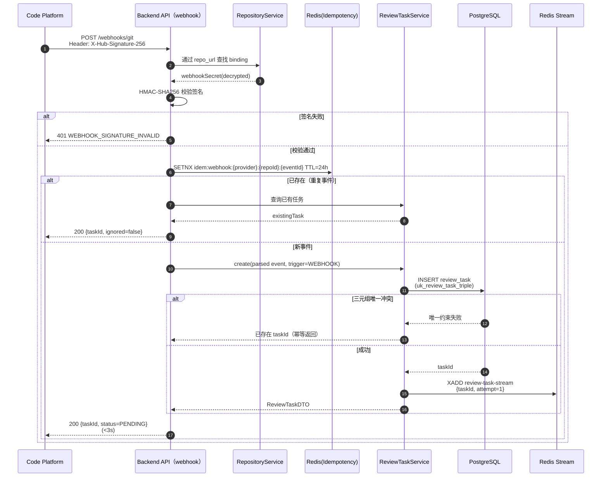

### SD-2：Task_Worker 完整执行链路

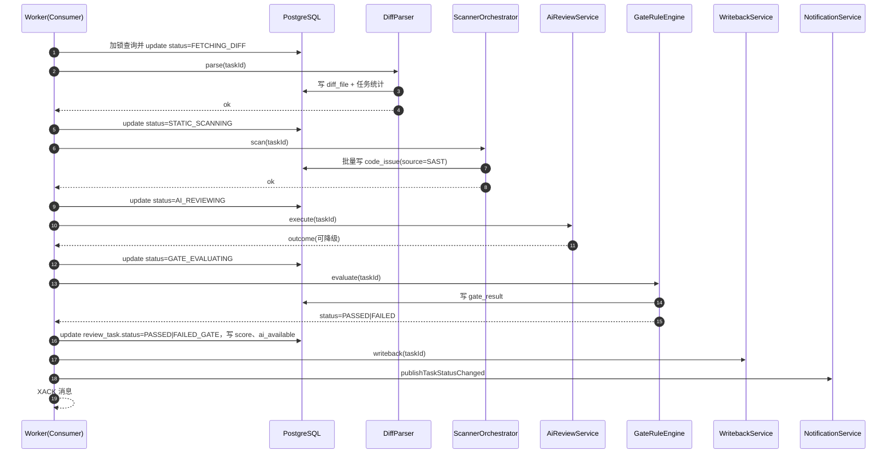

### SD-3：AI 降级路径（超时 / 5xx / Schema 校验失败）

```mermaid
sequenceDiagram
  autonumber
  participant W as Worker
  participant SF as SensitiveFilter
  participant AI as AiReviewClient
  participant DB as PostgreSQL

  W->>SF: filter(payload)
  alt 命中规则但 hash 未变化
    SF-->>W: throw SensitiveFilterFailureException
    W->>DB: task_log(level=ERROR, stage=AI_REVIEWING)
    W->>DB: gate_result.summary.aiAvailable=false 标记
    Note over W: 跳过 AI，进入 GATE_EVALUATING（R12.2）
  else 过滤通过
    SF-->>W: filtered payload
    W->>AI: POST /v1/review (timeout=AI_REVIEW_TIMEOUT_SECONDS)
    alt 超时 / 5xx
      AI--xW: TimeoutException / 5xx
      W->>DB: task_log(level=WARN), aiAvailable=false（R12.5）
    else 200 + Schema 校验失败
      AI-->>W: invalid JSON
      W->>DB: task_log(level=WARN), 丢弃响应（R12.4）
    else 200 + Schema OK
      AI-->>W: issues[]
      W->>DB: 批量写 code_issue(source=AI)
      W->>W: 计算 ai_risk_score 入 gate_result.summary
    end
  end
```

### SD-4：质量门禁判定 + Writeback 重试

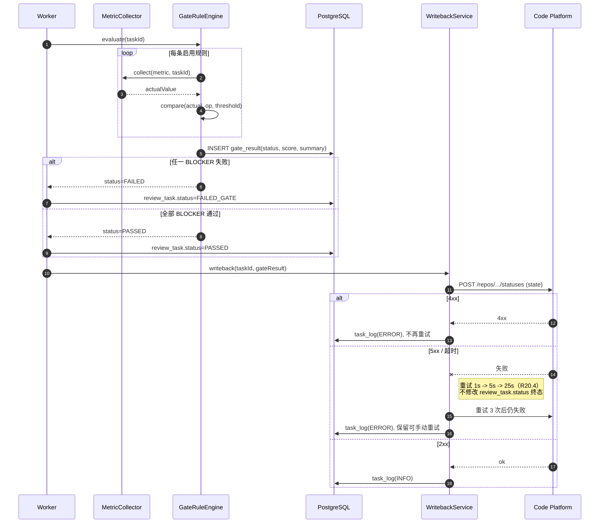

### SD-5：豁免审批闭环

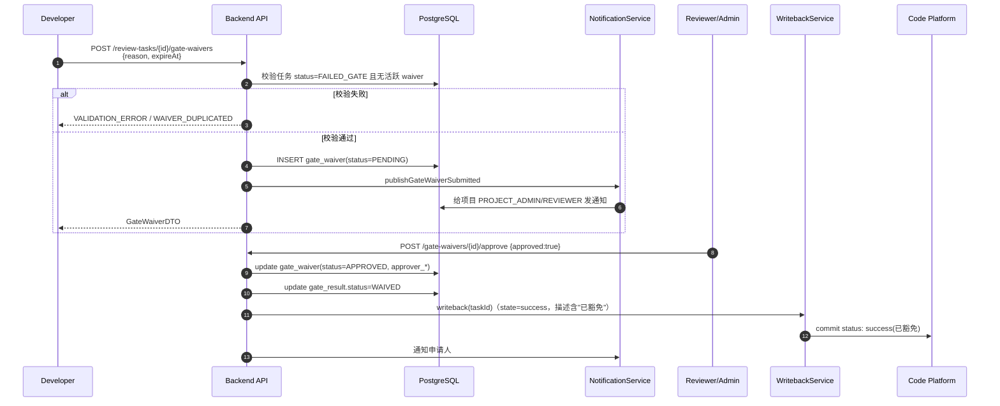

### SD-6：登录鉴权与禁用用户即时失效（Redis 黑名单）

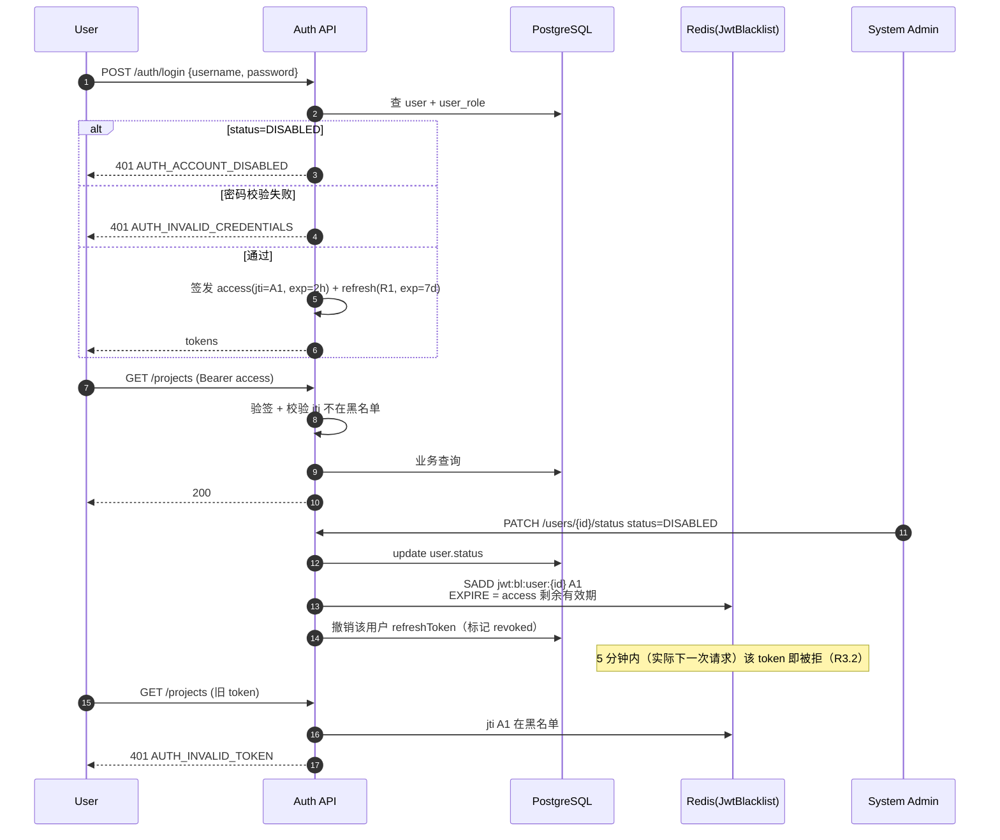

> Covers: R1, R3, R7, R9, R10, R11, R12, R14, R15, R19, R20

---

## 10. 质量门禁规则引擎（Gate Engine）

### 10.1 设计概览

引擎采用"采集器 + 比较器 + 聚合器"的策略组合：

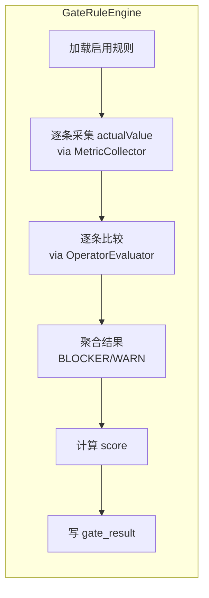

### 10.2 接口定义

```java
public interface MetricCollector<T extends Number> {
    String metric();
    T collect(Long taskId, MetricContext ctx);
}

@Component class CriticalIssueCountCollector  implements MetricCollector<Integer> { /* R14.1 */ }
@Component class SecurityIssueCountCollector  implements MetricCollector<Integer> { }
@Component class TestCoverageCollector        implements MetricCollector<Double>  { }
@Component class DuplicateRateCollector       implements MetricCollector<Double>  { }
@Component class AiRiskScoreCollector         implements MetricCollector<Integer> { /* R12.6 */ }
@Component class NewIssueCountCollector       implements MetricCollector<Integer> { }

public interface OperatorEvaluator {
    boolean compare(Number actual, String operator, String threshold);
}
```

`CriticalIssueCountCollector` 关键 SQL（R14.1 + R17.6 排除误报）：

```sql
SELECT COUNT(*) FROM code_issue
 WHERE task_id = :taskId
   AND severity IN ('CRITICAL','HIGH')
   AND status <> 'FALSE_POSITIVE';
```

### 10.3 比较器实现

```java
@Component
public class DefaultOperatorEvaluator implements OperatorEvaluator {
    @Override
    public boolean compare(Number actual, String op, String threshold) {
        BigDecimal a = new BigDecimal(actual.toString());
        BigDecimal t = new BigDecimal(threshold);
        return switch (op) {
            case "<=" -> a.compareTo(t) <= 0;
            case ">=" -> a.compareTo(t) >= 0;
            case "<"  -> a.compareTo(t) <  0;
            case ">"  -> a.compareTo(t) >  0;
            case "==" -> a.compareTo(t) == 0;
            case "!=" -> a.compareTo(t) != 0;
            default   -> throw new GateRuleInvalidException("operator=" + op);
        };
    }
}
```

### 10.4 聚合算法 + 评分公式

```java
public GateResult evaluate(Long taskId) {
    QualityGate gate = gateRepo.findEnabledByTask(taskId)
        .orElseThrow(() -> new GateRuleInvalidException("no enabled gate"));
    var details = gate.rules().stream().filter(GateRule::enabled).map(rule -> {
        var collector = collectors.get(rule.metric());
        Number actual = collector.collect(taskId, ctx);
        boolean passed = evaluator.compare(actual, rule.operator(), rule.threshold());
        return new RuleEval(rule, actual, passed);
    }).toList();

    boolean anyBlockerFailed = details.stream()
        .anyMatch(d -> !d.passed() && "BLOCKER".equals(d.rule().severity()));
    GateResultStatus status = anyBlockerFailed ? FAILED : PASSED;
    int score = computeScore(details);
    return persist(taskId, gate.id(), status, score, details);
}
```

**评分公式（默认实现，可由系统参数 `gate.score.formula` 调整）**：

```
score = round( clamp( 100 - Σ (weight_i × penalty_i ) , 0 , 100 ) )

penalty_i：
  - BLOCKER 失败：30
  - WARN    失败：10
  - 通过    ：0

weight_i 默认 1.0，可在 system_param 中按 metric 配置覆盖：
  gate.score.weight.critical_issue_count = 1.5
  gate.score.weight.test_coverage        = 1.2
```

### 10.5 规则版本管理

- 保存配置时：旧版本仅 `enabled=false`，插入新版本 `version = max(version)+1`，`enabled=true`。
- `uk_quality_gate_one_enabled` 部分唯一索引保证"同项目同时刻仅一个 enabled 版本"（R13.4）。
- 切换 `enabled` 时通过 `Audit_Service` 写审计（R22.1）。
- 历史 `gate_result` 不受新版本影响（结果中保存 `gate_id` 关联到具体版本）。

> Covers: R12.6, R13, R14, R17.6, R22.1

---

## 11. 静态扫描器适配层（Scanner Adapters）

### 11.1 接口与策略

```java
public interface StaticScannerAdapter {
    String name();                          // checkstyle / eslint / pylint / semgrep
    Set<String> supportedLanguages();
    boolean isAvailable();
    List<CodeIssue> scan(ScanContext ctx);
}

@Component class CheckstyleScanner implements StaticScannerAdapter { /* Java */ }
@Component class EsLintScanner    implements StaticScannerAdapter { /* JS / TS */ }
@Component class PylintScanner    implements StaticScannerAdapter { /* Python */ }
@Component class SemgrepScanner   implements StaticScannerAdapter { /* 通用安全 */ }

@Component
public class ScannerOrchestrator {
    public List<CodeIssue> scan(Long taskId) {
        var task = taskRepo.findById(taskId);
        var changedFiles = diffRepo.changedFilesOf(taskId);
        var lang = projectRepo.findById(task.projectId()).language();
        var scanners = adapters.stream()
            .filter(s -> s.supportedLanguages().contains(lang) || s.name().equals("semgrep"))
            .filter(StaticScannerAdapter::isAvailable)
            .toList();
        // 并行执行；R11.4：单扫描器失败不影响其他
        return scanners.parallelStream()
            .flatMap(s -> {
                try { return s.scan(new ScanContext(task, changedFiles)).stream(); }
                catch (Exception e) {
                    taskLogger.warn(taskId,"STATIC_SCANNING","scanner failed: "+s.name(),e);
                    return Stream.empty();
                }
            }).toList();
    }
}
```

### 11.2 严重等级归一化映射（R11.3）

| 工具原始等级 | 归一化 |
|---|---|
| Checkstyle: error | HIGH |
| Checkstyle: warning | MEDIUM |
| Checkstyle: info | INFO |
| ESLint: 2 | HIGH |
| ESLint: 1 | MEDIUM |
| Pylint: error/E | HIGH |
| Pylint: warning/W | MEDIUM |
| Pylint: convention/C, refactor/R | LOW |
| Semgrep: ERROR | CRITICAL |
| Semgrep: WARNING | HIGH |
| Semgrep: INFO | MEDIUM |
| 未知 | INFO（且打 WARN 日志） |

实现：

```java
public final class SeverityMapper {
    public static Severity normalize(String tool, String raw) { /* table-driven */ }
}
```

### 11.3 隔离执行方案

为避免在 backend / worker 容器内安装多语言扫描器与依赖，采用**进程隔离 + 可选 Docker 隔离**：

- 默认：`ProcessBuilder` 在 worker 容器内启动扫描器子进程，通过临时工作目录传递变更文件。
- 安全模式（推荐生产）：通过宿主机挂载的 docker socket，`docker run --rm -v <workdir>:/src <scanner-image>` 隔离执行。
- `scanner_config.command` 字段为命令模板，支持占位符 `{workdir}`、`{file}`，便于切换。
- 每次扫描有独立超时（默认 60s）、CPU/内存限制（Docker `--cpus`、`--memory`）。
- 扫描产物（XML/JSON）由 `result_parser_type` 决定使用哪个 `ResultParser` 转换为 `CodeIssue`。

```java
public interface ScannerProcessRunner {
    ScannerOutput run(ScannerConfig cfg, Path workdir, List<String> files);
}
```

### 11.4 仅扫描变更文件（R11.5）

`ScanContext.files()` 仅包含 `diff_file` 中的非 oversized 文件路径。`Checkstyle` 等支持文件级参数的扫描器直接传入；`Semgrep` 支持 `--include` 参数；不支持的工具采用临时工作目录过滤。

> Covers: R11

---

## 12. AI 评审客户端（AI Review Client）

### 12.1 Prompt 模板与上下文构造

**Prompt 模板**（system + user 两段，发送至 OpenAI 兼容 chat completions 接口）：

```text
[system]
You are a senior code reviewer for {language} projects. You MUST respond with VALID JSON
ONLY, conforming to the provided JSON Schema. Do not output anything outside the JSON.

[user]
项目语言: {language}
关注门禁指标: {metrics}              # e.g. critical_issue_count, ai_risk_score
变更文件清单:
{fileList}                            # path | changeType | +adds -dels

请基于以下变更代码进行评审，给出潜在问题、原因、修复建议、严重等级、置信度。

变更代码片段（已脱敏）:
<<<DIFF
{filteredDiff}
>>>DIFF

请按 JSON Schema 输出，issues 至少 0 条至多 50 条，严重等级仅限
[CRITICAL, HIGH, MEDIUM, LOW, INFO]，confidence 取值 0~1。
```

### 12.2 响应 JSON Schema（R12.3）

```json
{
  "$schema": "https://json-schema.org/draft/2020-12/schema",
  "type": "object",
  "required": ["issues"],
  "properties": {
    "summary": {"type": "string", "maxLength": 2000},
    "issues": {
      "type": "array",
      "maxItems": 50,
      "items": {
        "type": "object",
        "required": ["filePath","severity","description","suggestion","confidence"],
        "properties": {
          "filePath":   {"type":"string","maxLength":512},
          "lineNo":     {"type":"integer","minimum":0,"maximum":1000000},
          "severity":   {"type":"string","enum":["CRITICAL","HIGH","MEDIUM","LOW","INFO"]},
          "ruleCode":   {"type":"string","maxLength":128},
          "description":{"type":"string","minLength":5,"maxLength":4000},
          "suggestion": {"type":"string","minLength":5,"maxLength":4000},
          "confidence": {"type":"number","minimum":0,"maximum":1}
        }
      }
    }
  }
}
```

### 12.3 Sensitive_Filter 实现（R12.2 / R23.4）

**三道闸**：

1. **路径白名单**：跳过文件路径匹配以下任一规则的整文件——`.env`、`*.env.*`、`*.pem`、`*.key`、`*.crt`、`*.p12`、`*.jks`、`secrets/**`、`config/secret-*`。
2. **Token 正则替换**：对所有进入 AI 的正文做以下替换为 `***REDACTED***`：
   - AWS Access Key：`AKIA[0-9A-Z]{16}`
   - OpenAI Key：`sk-[A-Za-z0-9]{32,}`
   - GitHub Token：`gh[pousr]_[A-Za-z0-9]{36,}`
   - 通用密钥短语：`(?i)(password|secret|token|api[_-]?key)\s*[:=]\s*['"][^'"]+['"]`
3. **哈希前后比对**：对原始 payload 与过滤后 payload 计算 SHA-256；若 raw 命中过滤规则但 hash 未变化（说明未真实过滤），抛 `SensitiveFilterFailureException`，AI 调用中止并写 `task_log(level=ERROR)`。

```java
public class DefaultSensitiveFilter implements SensitiveFilter {
    @Override
    public FilteredPayload filter(AiReviewPayload raw) {
        boolean expectChange = anyHit(raw);
        AiReviewPayload filtered = redact(raw);
        if (expectChange && hash(raw).equals(hash(filtered))) {
            throw new SensitiveFilterFailureException(
                "filter expected to mutate payload but hash unchanged");
        }
        return new FilteredPayload(filtered, expectChange);
    }
}
```

### 12.4 超时与降级（R12.5）

```java
@Component
public class HttpAiReviewClient implements AiReviewClient {
    private final RestClient client;
    private final ModelConfig active;        // 系统管理选择 enabled=true 的第一条
    @Override
    public AiReviewResponse review(AiReviewRequest req) {
        try {
            return client.post()
                .uri(active.baseUrl() + "/v1/chat/completions")
                .header("Authorization","Bearer " + decryptedKey)
                .body(req)
                .retrieve()
                .toEntity(AiReviewResponse.class)
                .getBody();
        } catch (ResourceAccessException timeout) {
            throw new AiServiceUnavailableException("timeout", timeout);
        } catch (HttpServerErrorException e5xx) {
            throw new AiServiceUnavailableException("5xx: " + e5xx.getStatusCode(), e5xx);
        }
        // 4xx 直接抛出，由 service 视为不可恢复并记录 ERROR
    }
}
```

降级路径：

- 超时 / 5xx → `AiServiceUnavailableException` → `AiReviewService` 捕获后写 `gate_result.summary.aiAvailable=false`，**任务继续推进至 `GATE_EVALUATING`，不置 `EXECUTION_FAILED`**（R12.5）。
- 200 但 Schema 校验失败 → 写 `task_log(WARN)`，丢弃响应，不影响 SAST 结果（R12.4）。

### 12.5 ai_risk_score 计算（R12.6）

```
score_per_issue = severityWeight × confidence

severityWeight:
  CRITICAL=100, HIGH=70, MEDIUM=40, LOW=15, INFO=5

ai_risk_score = clamp( max(score_per_issue) * 0.6 + avg(score_per_issue) * 0.4 , 0, 100 )

若 issues 为空，ai_risk_score = 0
若 aiAvailable=false，ai_risk_score 不写入（含规则被跳过时该规则视为通过，由策略决定）
```

> Covers: R12, R23.4

---

## 13. 安全与合规设计（Security）

### 13.1 JWT 设计

| 项 | accessToken | refreshToken |
|---|---|---|
| 算法 | **HS256**（密钥来自 `jwt.secret`，长度 ≥ 32 字节） | HS256 |
| 有效期 | 默认 2 小时（`jwt.access.ttl`） | 默认 7 天 |
| Claims | `sub=userId`、`username`、`roles`、`jti`（UUID）、`iat`、`exp` | `sub`、`jti`、`tokenType=refresh`、`iat`、`exp` |
| 黑名单存储 | Redis Set `jwt:bl:user:{userId}`，元素为 jti，TTL=token 剩余有效期 | refresh 撤销表 `jwt:rt:revoked:{jti}` |

> 使用 HS256（共享密钥）而非 RS256，便于课程项目部署；如未来引入多服务可切换 RS256（密钥无需改业务代码，仅 `JwtTokenProvider` 实现切换）。

### 13.2 加密存储（AES-GCM-256）

```java
@Component
public class AesGcmCipher {
    private static final int GCM_TAG_BITS = 128, IV_LEN = 12;
    private final SecretKey key;          // tokenEncryptionKey 派生（PBKDF2）

    public String encrypt(String plain) {
        byte[] iv = SecureRandom.getInstanceStrong().generateSeed(IV_LEN);
        Cipher c = Cipher.getInstance("AES/GCM/NoPadding");
        c.init(Cipher.ENCRYPT_MODE, key, new GCMParameterSpec(GCM_TAG_BITS, iv));
        byte[] ct = c.doFinal(plain.getBytes(UTF_8));
        return base64( concat(iv, ct) );
    }
    public String decrypt(String b64) { /* 反向 */ }
}
```

应用范围：

- `repository_binding.access_token_encrypted`、`webhook_secret_encrypted`（R5.3）
- `model_config.api_key_encrypted`（R21.1）
- `tokenEncryptionKey` 自身保存在系统参数表，但**密文形态由启动参数 `--app.master-key` 解锁**（不持久化于库）

### 13.3 Webhook 签名校验（HMAC-SHA256）

```java
public boolean verify(String secret, String body, String signatureHeader) {
    String expected = "sha256=" + HmacUtils.hmacSha256Hex(secret, body);
    return MessageDigest.isEqual(expected.getBytes(UTF_8),
                                 signatureHeader.getBytes(UTF_8));
}
```

- 头部名称由系统参数 `WEBHOOK_SIGNATURE_HEADER` 控制（默认 `X-Hub-Signature-256`，兼容 GitHub 风格；GitLab 使用 `X-Gitlab-Token`，Gitee 使用 `X-Gitee-Token`，由 `provider` 字段路由到不同 Verifier）。
- 必须使用 `MessageDigest.isEqual`（恒定时间比较）。

### 13.4 敏感字段掩码切面

```java
@Aspect @Component
public class ResponseMaskingAspect {
    private static final Set<String> SENSITIVE =
        Set.of("password","passwordHash","accessToken","apiKey",
               "webhookSecret","apiKeyEncrypted","accessTokenEncrypted");
    @AfterReturning(pointcut="execution(public * com.acrqg.platform..controller..*(..))",
                    returning = "ret")
    public Object mask(Object ret) {
        return JsonMaskUtils.maskFields(ret, SENSITIVE);
    }
}
```

日志层使用 `MaskingLogbackEncoder`：在 JSON 序列化前对 message 中匹配 token 正则（同 SensitiveFilter 第 2 道闸）的子串替换为 `****`。

### 13.5 HTTPS 强制（R23.6）

```java
@Configuration
public class HttpsRedirectConfig {
    @Bean
    @Profile("prod")
    public SecurityFilterChain httpsRedirect(HttpSecurity http) throws Exception {
        http.requiresChannel(c -> c.anyRequest().requiresSecure());   // 308 redirect
        // 配合反向代理（nginx）的 X-Forwarded-Proto 识别
        http.addFilterBefore(new ForwardedHeaderFilter(), ChannelProcessingFilter.class);
        return http.build();
    }
}
```

nginx 端：监听 80 → 308 重定向到 443；同时设置 HSTS 头部（`Strict-Transport-Security: max-age=31536000`）。

> Covers: R1, R3.2, R5.3, R5.4, R7.1, R7.2, R12.2, R21.1, R22.5, R23

---

## 14. 可观测性（Observability）

### 14.1 日志方案

- **框架**：Logback + `logstash-logback-encoder`（JSON 格式）。
- **traceId**：在 `TraceIdFilter` 入口处从 `X-Request-Id` 头读取或新生成（UUID），写入 MDC；`requestId` 字段同步写入 ApiResponse。
- **关键字段**：`@timestamp`、`level`、`logger`、`thread`、`traceId`、`taskNo`（在 Worker 链路 MDC 中追加）、`userId`、`message`、`stack_trace`。
- **采样**：`task_log` 表保存任务侧详细执行日志（结构化，可通过 API 查询），与文件日志（不结构化）解耦。
- **Mask**：见 13.4 中 `MaskingLogbackEncoder`。

### 14.2 指标（Micrometer + Prometheus）

通过 `spring-boot-starter-actuator` 暴露 `/metrics`（仅 Prometheus 抓取），核心自定义指标：

| 指标名 | 类型 | 说明 |
|---|---|---|
| `acrqg_task_queue_length` | Gauge | Redis Stream pending entries 数 |
| `acrqg_task_stage_duration_seconds{stage,result}` | Histogram | 各阶段耗时 |
| `acrqg_task_total{status}` | Counter | 任务总数（按终态） |
| `acrqg_ai_call_total{outcome}` | Counter | AI 调用次数（success/timeout/5xx/schema_error） |
| `acrqg_ai_call_duration_seconds` | Histogram | AI 调用耗时 |
| `acrqg_writeback_total{provider,result}` | Counter | 状态回写结果 |
| `acrqg_scanner_duration_seconds{scanner}` | Histogram | 扫描器耗时 |
| `acrqg_http_server_requests_seconds`（Spring 默认） | Histogram | HTTP 接口耗时（含 P95） |
| `acrqg_jwt_blacklist_size` | Gauge | 黑名单大小 |

### 14.3 健康检查 `/health`

由 Spring Actuator 提供，自定义 indicator：

```java
@Component class RedisStreamHealthIndicator implements HealthIndicator { /* PING + XLEN */ }
@Component class AiServiceHealthIndicator   implements HealthIndicator { /* 周期性探活 */ }
```

`/health` 默认返回 200 + `{status: UP, components: {...}}`；docker-compose / k8s livenessProbe 直接对接。

### 14.4 任务执行链路（R24.5）

通过 `taskNo` 串联：

- HTTP 接口日志：包含 `traceId` 与 `taskNo`（请求 PathVariable）。
- Worker 阶段日志：MDC 中 `taskNo` 自动注入。
- AI 调用日志：在 `HttpAiReviewClient` 写入 `taskNo`、`modelName`、`durationMs`、`statusCode`。
- task_log 表：API 提供 `/review-tasks/{id}/logs` 查询（R16.5）。

> Covers: R1, R3.2, R12, R14, R20, R23.3, R24.5, R24.6

---

## 15. 测试策略（Testing Strategy）

> 本特性 PBT **适用**：核心模块（状态机 / 规则引擎 / Sensitive_Filter / Diff_Parser / 幂等控制）满足"对全输入有不变量"的判定，且可通过 mock 在内存中以低成本运行 100+ 次。
> 但 IaC 的部分（docker-compose）、UI 渲染部分（前端 Vue 组件）不适合 PBT，分别使用 docker-compose-up 探活与 Vitest snapshot/交互测试。

### 15.1 单元测试（覆盖率目标 ≥ 70%）

| 模块 | 重点用例 |
|---|---|
| `task` (TaskOrchestrator + 状态机) | 合法迁移路径全覆盖；非法迁移抛异常；阶段超时 → EXECUTION_FAILED；retry / cancel 状态门控 |
| `diff` (DiffParser) | hunk 解析；oversized 标记；3 种 changeType；拉取失败异常路径 |
| `gate` (GateRuleEngine + Collectors + Evaluator) | 6 metric × 5 operator × 2 severity 矩阵；BLOCKER/WARN 聚合；评分公式边界 |
| `ai` (SensitiveFilter) | 路径白名单命中跳过；Token 正则替换；hash 比对失败抛异常；命中点数与正则覆盖 |
| `webhook` | HMAC 签名校验对/错；ping 事件忽略；幂等返回已有任务 |
| `auth` | JWT 签发/解析/过期；黑名单命中即时失效；BCrypt 校验 |

工具：JUnit 5 + Mockito + AssertJ。每个测试方法名形如 `method_state_expectedBehavior`。

### 15.2 集成测试（Spring Boot Test + Testcontainers）

```java
@SpringBootTest
@Testcontainers
class AuthIntegrationTest {
    @Container static PostgreSQLContainer<?> pg = new PostgreSQLContainer<>("postgres:15");
    @Container static GenericContainer<?> redis = new GenericContainer<>("redis:7").withExposedPorts(6379);

    @DynamicPropertySource
    static void props(DynamicPropertyRegistry r) {
        r.add("spring.datasource.url", pg::getJdbcUrl);
        r.add("spring.data.redis.host", redis::getHost);
    }
    /* 用例 ... */
}
```

集成测试覆盖（与 R25.2 对齐）：

- 认证：登录成功/失败/禁用账号；token 刷新；登出后旧 token 失效。
- 项目 / Webhook / 评审任务全链路：构造 mock provider HTTP → POST /webhooks/git → 任务进入 PENDING → Worker 模拟驱动 → 报告可查询。
- 报告 / 门禁 / 问题状态：完整流转。
- 通知：状态切换触发通知；列表查询过滤。
- 越权（R25.5）：非项目成员、非项目管理员调用各接口均返回 403。

### 15.3 契约测试（API ↔ DTO ↔ OpenAPI）

- springdoc-openapi 启动期生成 `openapi.json`；CI 阶段对比基线版本；DTO 字段变更必须有版本说明。
- 通过 `springwolf-asyncapi`（可选）描述异步消息（review-task-stream message schema）。

### 15.4 属性测试（jqwik）

针对第 19 节列出的 8 条属性，每条至少 100 次迭代（`@Property(tries = 100)`）。

```java
@Property(tries = 200)
boolean stateTransitionsFollowDirectedGraph(@ForAll @From("randomTransition") Transition t) {
    return ALLOWED_EDGES.contains(t) == StateMachine.tryTransit(t.from, t.to);
}
```

### 15.5 性能基准

```bash
# k6 脚本示例（与 R16.6 / R24.2 对齐）
k6 run -u 100 -d 5m perf/report-query.js
# 阈值断言：http_req_duration p(95) < 2000ms
```

测试入口：`/api/v1/review-tasks/{id}/report`，预先种子化 100 个任务、每任务 200 个 issue。

### 15.6 越权测试用例集（R25.5 / SECURITY_TEST_001）

| 调用者 | 被测接口 | 期望 |
|---|---|---|
| DEVELOPER 非项目成员 | `GET /projects/{id}` | 403 |
| DEVELOPER 项目成员 | `PUT /projects/{id}` | 403 |
| REVIEWER 项目成员 | `POST /projects/{id}/repository` | 403 |
| 任意非 SYSTEM_ADMIN | `GET /admin/audit-logs` | 403 |
| 不带 token | 任意非白名单接口 | 401 |
| 过期 token | 任意非白名单接口 | 401 |
| 被禁用用户 token | 任意非白名单接口 | 401 |
| CI_CD 角色 | `POST /projects` | 403 |

> Covers: R1~R25（测试集合覆盖全部）

---

## 16. 错误处理（Error Handling）

### 16.1 错误码表（与 02 号文档一致 + 必要补充）

| 错误码 | HTTP | 来源 | 说明 |
|---|---|---|---|
| `0` | 200 | 全局 | 成功 |
| `AUTH_INVALID_CREDENTIALS` | 401 | R1.2 | 用户名或密码错误 |
| `AUTH_INVALID_TOKEN` | 401 | R1.4 / R3.2 | 令牌无效或过期 |
| `AUTH_ACCOUNT_DISABLED` | 401 | R1.3 | 账号被禁用（**新增**，原文档缺失） |
| `PERMISSION_DENIED` | 403 | R2.1 / R3.3 / R4.4 / R6 / R18.4 / R19.4 / R21.6 | 权限不足 |
| `VALIDATION_ERROR` | 400 | R3 / R4.3 / R6.2 / R8.2 / R15.2 / R17.2-3-5 / R18.2 / R21.4 | 参数校验失败 |
| `PROJECT_NAME_EXISTS` | 409 | R4.2 | 项目名称已存在 |
| `REPOSITORY_UNREACHABLE` | 422 | R5.2 | 仓库不可访问 |
| `WEBHOOK_SIGNATURE_INVALID` | 401 | R7.2 | Webhook 签名失败 |
| `TASK_DUPLICATED` | 409 | R8.3 | 评审任务重复 |
| `TASK_NOT_RETRYABLE` | 409 | R9.5 | 当前任务状态不可重试 |
| `TASK_NOT_FOUND` | 404 | 通用 | 任务不存在（**新增**） |
| `AI_SERVICE_UNAVAILABLE` | 503 | R12.5 | AI 服务不可用（仅暴露给运维查询，业务流程不返给用户） |
| `GATE_RULE_INVALID` | 400 | R13.3 | 门禁规则非法 |
| `WAIVER_DUPLICATED` | 409 | R15.6 | 已存在有效豁免（**新增**） |
| `INTERNAL_ERROR` | 500 | 全局 | 系统繁忙 |

### 16.2 重试策略

| 场景 | 策略 | 实现 |
|---|---|---|
| Writeback 5xx / 超时 | 1s → 5s → 25s 指数退避，至多 3 次（R20.4） | Spring Retry `@Retryable(backoff=@Backoff(delay=1000, multiplier=5))` |
| Writeback 4xx | 不重试，写 ERROR 日志（R20.3） | catch + log + 标记可手动重试 |
| Worker 阶段失败 | 不自动重试；失败任务进入 EXECUTION_FAILED，由用户调 retry（R9.4） | 状态机自然落入终态 |
| Webhook 拉取失败重试 | 不在系统侧重试（依赖代码平台 Webhook delivery 重发机制） | — |
| AI 5xx / 超时 | 不重试（直接降级），减少串行等待（R12.5） | catch → aiAvailable=false |

### 16.3 任务断点恢复策略（R24.4）

启动期扫描中状态修复：

```java
@Component
public class TaskRecoveryRunner implements ApplicationRunner {
    @Override
    public void run(ApplicationArguments args) {
        if (!isWorkerProfile()) return;
        var stuck = taskRepo.findByStatusIn(List.of(
            FETCHING_DIFF, STATIC_SCANNING, AI_REVIEWING, GATE_EVALUATING));
        for (var t : stuck) {
            // 策略 A（默认）：标记为 EXECUTION_FAILED，写日志说明 worker 重启
            taskService.transitTo(t.id(), EXECUTION_FAILED);
            taskLogger.warn(t.id(), t.status().name(),
                "task interrupted by worker restart, marked EXECUTION_FAILED");
        }
        // 策略 B（可选）：通过 XPENDING + XCLAIM 接管未 ACK 的消息，重新从 PENDING 起调度。
    }
}
```

R24.4 关键约束：任务任何情况下不得永久停留在中间状态，且不得直接跳到 PASSED。本设计选择策略 A（更简单且符合"断点恢复"语义最严的解释）；策略 B 可作为后续优化项启用。

> Covers: R1.2, R1.3, R1.4, R3.2, R3.3, R4.2, R4.3, R5.2, R6.2, R7.2, R8.2, R8.3, R9.4, R9.5, R12.5, R13.3, R14.7, R15.2, R15.6, R17, R18.2, R18.4, R19.4, R20.3, R20.4, R21.4, R21.6, R24.4

---

## 17. 部署与运行时（Deployment）

### 17.1 docker-compose.yml 服务清单

```yaml
version: "3.9"
services:
  postgres:
    image: postgres:15
    environment:
      POSTGRES_DB: quality_gate
      POSTGRES_USER: acrqg
      POSTGRES_PASSWORD: ${DB_PASSWORD}
    ports: ["5432:5432"]
    volumes: ["pgdata:/var/lib/postgresql/data",
              "./db/init:/docker-entrypoint-initdb.d:ro"]
    healthcheck:
      test: ["CMD-SHELL", "pg_isready -U acrqg -d quality_gate"]

  redis:
    image: redis:7
    command: ["redis-server","--appendonly","yes"]
    ports: ["6379:6379"]
    volumes: ["redisdata:/data"]
    healthcheck:
      test: ["CMD","redis-cli","ping"]

  backend:
    build: ./acrqg-platform
    environment:
      APP_ENV: prod
      SPRING_PROFILES_ACTIVE: prod,api
      DB_URL: jdbc:postgresql://postgres:5432/quality_gate
      DB_USER: acrqg
      DB_PASSWORD: ${DB_PASSWORD}
      REDIS_URL: redis://redis:6379/0
      AI_REVIEW_BASE_URL: ${AI_REVIEW_BASE_URL}
      AI_REVIEW_TIMEOUT_SECONDS: 60
      WEBHOOK_SIGNATURE_HEADER: X-Hub-Signature-256
      TOKEN_ENCRYPTION_KEY: ${TOKEN_ENCRYPTION_KEY}
      JWT_SECRET: ${JWT_SECRET}
    depends_on: { postgres: {condition: service_healthy}, redis: {condition: service_healthy} }
    ports: ["8080:8080"]

  worker:
    build: ./acrqg-platform
    environment:
      APP_ENV: prod
      SPRING_PROFILES_ACTIVE: prod,worker
      DB_URL: jdbc:postgresql://postgres:5432/quality_gate
      DB_USER: acrqg
      DB_PASSWORD: ${DB_PASSWORD}
      REDIS_URL: redis://redis:6379/0
      AI_REVIEW_BASE_URL: ${AI_REVIEW_BASE_URL}
      AI_REVIEW_TIMEOUT_SECONDS: 60
      REVIEW_WORKER_CONCURRENCY: 4
      TOKEN_ENCRYPTION_KEY: ${TOKEN_ENCRYPTION_KEY}
    depends_on: { postgres: {condition: service_healthy}, redis: {condition: service_healthy} }
    deploy: { replicas: 1 }    # 可水平扩展

  frontend:
    build: ./acrqg-web
    environment:
      VITE_API_BASE: /api/v1
    ports: ["80:80"]            # 由 nginx 反向代理 backend
    depends_on: [backend]

volumes: { pgdata: {}, redisdata: {} }
```

### 17.2 配置项与环境变量

| 变量 | 用途 | 默认 |
|---|---|---|
| `APP_ENV` | 环境标识：dev/test/prod | dev |
| `DB_URL` / `DB_USER` / `DB_PASSWORD` | PostgreSQL 连接 | - |
| `REDIS_URL` | Redis 连接 | redis://localhost:6379/0 |
| `AI_REVIEW_BASE_URL` | AI 服务 baseUrl | - |
| `AI_REVIEW_TIMEOUT_SECONDS` | AI 调用超时（10~300） | 60 |
| `REVIEW_WORKER_CONCURRENCY` | 单 worker 并发线程数（1~32） | 4 |
| `WEBHOOK_SIGNATURE_HEADER` | Webhook 签名头名 | X-Hub-Signature-256 |
| `TOKEN_ENCRYPTION_KEY` | AES-GCM 派生密钥（推荐 ≥ 32 字节） | - |
| `JWT_SECRET` | JWT HS256 共享密钥 | - |
| `JWT_ACCESS_TTL_SECONDS` | accessToken 有效期 | 7200 |
| `JWT_REFRESH_TTL_SECONDS` | refreshToken 有效期 | 604800 |

### 17.3 Profile：dev / test / prod

| Profile | 区别 |
|---|---|
| `dev` | 本地启动，关闭 HTTPS 强制；模型调用可走本地 mock；启用 H2 备用（仅紧急） |
| `test` | 运行集成测试时启用 Testcontainers；自动初始化测试数据 |
| `prod` | 启用 HTTPS 重定向、HSTS、JSON 日志、Actuator endpoint 仅暴露 health/metrics；关闭 swagger 在外网入口 |

应用同时由 `api` / `worker` 子 profile 控制服务身份：

- `api`：注册 Web 端点、Webhook 处理；不消费 Redis Stream。
- `worker`：注册 Stream consumer、状态恢复；不暴露业务 HTTP 接口（仅 `/health`、`/metrics`）。

> Covers: R12.5, R21.4, R23.6, R24.3, R24.6

---

## 18. 需求追溯矩阵（Requirements Traceability Matrix）

| 需求 | 简述 | 关联设计章节 | 关键组件/类 |
|---|---|---|---|
| R1 | 用户登录与令牌签发 | §6.1, §8.5, §13.1, SD-6 | AuthService, JwtTokenProvider, BCryptPasswordEncoder |
| R2 | 角色与权限控制 | §6.1, §8.6, §15.6 | @RequirePermission, PermissionAspect, PermissionEvaluator, AuditService |
| R3 | 用户管理 | §6.1, §13.1, SD-6 | UserService, JwtBlacklist (Redis Set) |
| R4 | 项目创建与维护 | §6.2, §7.2, §8.4 | ProjectService, project 表, AuditService |
| R5 | 仓库绑定 | §6.2, §7.2, §13.2 | RepositoryService, AesGcmCipher, ProviderClient.ping |
| R6 | 项目成员管理 | §6.2, §7.2 | ProjectService.addMember/removeMember, project_member 表 |
| R7 | Webhook 接收与任务创建 | §6.3, §13.3, SD-1 | WebhookService, IdempotencyStore (Redis), uk_review_task_triple |
| R8 | 手动创建评审任务 | §6.3, §8.4 | ReviewTaskService, IdempotencyStore (Redis) |
| R9 | 任务执行编排与重试 | §6.3.1, §16.3, SD-2 | TaskOrchestrator, TaskStage, ReviewTaskService.retry/cancel |
| R10 | 代码差异解析 | §6.4, §7.2, SD-2 | DiffParser, ProviderClient.fetchDiff, diff_file 表 |
| R11 | 静态代码扫描 | §6.5, §11 | ScannerOrchestrator, StaticScannerAdapter, SeverityMapper |
| R12 | AI 辅助评审与降级 | §6.6, §12, SD-3 | AiReviewService, SensitiveFilter, HttpAiReviewClient, JSON Schema |
| R13 | 质量门禁配置 | §6.7, §10.5, §7.2 | QualityGateService, uk_quality_gate_one_enabled |
| R14 | 门禁判定与回写 | §6.7, §10, SD-4 | GateRuleEngine, MetricCollectors, WritebackService |
| R15 | 门禁豁免审批 | §6.7, §7.2, SD-5 | GateWaiverService, uk_gate_waiver_active |
| R16 | 评审报告展示 | §6.8, §7.3, §8.7 | ReportService, IssueService, 索引 idx_code_issue_task_severity_source |
| R17 | 问题生命周期管理 | §6.8, §8.4 | IssueService, issue_history, IssueStatusChangeRequest 校验 |
| R18 | 项目质量看板 | §6.8, §7.3 | DashboardService, idx_review_task_project_ts |
| R19 | 通知中心 | §6.9, §7.2 | NotificationService, idx_notification_user_read |
| R20 | 门禁结果回写 | §6.9, §16.2, SD-4 | WritebackService, ProviderClient, @Retryable |
| R21 | 系统参数与扫描器 / 模型管理 | §6.10, §13.2, §13.4 | AdminService, AesGcmCipher, ResponseMaskingAspect |
| R22 | 审计日志 | §6.10, §7.2 | AuditService, audit_log + reject_audit_modify 触发器 |
| R23 | 安全性与隐私合规 | §13 | JwtAuthFilter, AesGcmCipher, SensitiveFilter, HttpsRedirectConfig, ResponseMaskingAspect |
| R24 | 性能、可靠性与可观测性 | §6.3.2, §14, §16.3, §17 | RedisStreamPublisher/Consumer, Actuator, TaskRecoveryRunner |
| R25 | 可测试性与覆盖率 | §15 | JUnit 5 + Mockito + Testcontainers + jqwik + k6 |

> Covers: R1~R25（全集）

---

## 19. 正确性属性（Correctness Properties for PBT）

> *A property is a characteristic or behavior that should hold true across all valid executions of a system — essentially, a formal statement about what the system should do. Properties serve as the bridge between human-readable specifications and machine-verifiable correctness guarantees.*

经过 prework 与属性反思，本特性最终保留 **8 条不变式**作为属性测试。每条均使用 [jqwik](https://jqwik.net) 实现，配置 `@Property(tries = 100)` 起步（关键属性 200~500 次）。所有属性测试在 `src/test/java/com/acrqg/platform/property/` 下。

> 标签格式：`Feature: ai-code-review-quality-gate-platform, Property {N}: {property text}`

### Property 1：任务状态机迁移有向图

*For any* 任务状态对 `(from, to) ∈ ReviewTaskStatus²`，`StateMachine.tryTransit(from, to)` 成功 当且仅当 `(from, to)` 属于设计中定义的合法迁移边集合。

**Validates: Requirements 9.1, 9.3**

```java
@Property(tries = 200)
boolean transitionsFollowDirectedGraph(
        @ForAll ReviewTaskStatus from,
        @ForAll ReviewTaskStatus to) {
    boolean expected = ALLOWED_EDGES.contains(new Edge(from, to));
    boolean actual;
    try { stateMachine.tryTransit(from, to); actual = true; }
    catch (BusinessException e) { actual = false; }
    return expected == actual;
}
```

### Property 2：问题状态迁移合法集

*For any* 问题状态对 `(from, to) ∈ CodeIssueStatus²` 与任意有效 comment（≥5 字符若需），`IssueService.changeStatus` 仅在迁移属于合法集合时成功，否则抛 `VALIDATION_ERROR`。

**Validates: Requirements 17.1, 17.2, 17.3**

```java
@Property(tries = 200)
void issueTransitionsFollowAllowedSet(
        @ForAll CodeIssueStatus from,
        @ForAll CodeIssueStatus to,
        @ForAll @StringLength(min=5,max=200) String comment) {
    var issue = issueFactory.persistedWithStatus(from);
    boolean expectOk = ALLOWED_ISSUE_EDGES.contains(new Edge(from, to))
        && (to != FALSE_POSITIVE && to != CLOSED || comment.trim().length() >= 5);
    if (expectOk) {
        var dto = issueService.changeStatus(issue.id(),
            new IssueStatusChangeRequest(to, comment));
        assertThat(dto.status()).isEqualTo(to.name());
    } else {
        assertThatThrownBy(() -> issueService.changeStatus(issue.id(),
            new IssueStatusChangeRequest(to, comment)))
            .isInstanceOf(BusinessException.class)
            .hasFieldOrPropertyWithValue("code", ErrorCode.VALIDATION_ERROR);
    }
}
```

### Property 3：任务幂等（三元组唯一性）

*For any* 三元组 `(projectId, prId, commitSha)` 与任意 N (1≤N≤20) 次并发提交，最终数据库中状态非 `EXECUTION_FAILED` 的活跃任务数最多为 1，且所有调用都返回相同 `taskId`。

**Validates: Requirements 7.4, 8.3**

```java
@Property(tries = 50)
void concurrentTriplesProduceAtMostOneActiveTask(
        @ForAll @LongRange(min=1, max=10000) long projectId,
        @ForAll @StringLength(min=1, max=64) String prId,
        @ForAll @StringLength(min=8, max=128) String commitSha,
        @ForAll @IntRange(min=2, max=20) int n) throws Exception {
    var es = Executors.newFixedThreadPool(n);
    var futures = IntStream.range(0, n).mapToObj(i -> es.submit(() ->
        reviewTaskService.create(buildReq(projectId, prId, commitSha), null, WEBHOOK).id()
    )).toList();
    Set<Long> ids = new HashSet<>();
    for (var f : futures) ids.add(f.get());
    long active = countActive(projectId, prId, commitSha);
    assertThat(ids).hasSize(1);
    assertThat(active).isLessThanOrEqualTo(1);
}
```

### Property 4：门禁判定 BLOCKER ⇔ FAILED

*For any* 启用规则集合 R 与任意 metric→actualValue 映射 M，`GateRuleEngine.evaluate(...).status == FAILED` 当且仅当 `∃ r ∈ R : !compare(M[r.metric], r.operator, r.threshold) ∧ r.severity == BLOCKER`。

**Validates: Requirements 13.3, 14.2, 14.3, 14.4**

```java
@Property(tries = 500)
boolean blockerFailureIffGateFailed(
        @ForAll("randomGateRules") List<GateRule> rules,
        @ForAll("randomMetricValues") Map<String,Number> values) {
    var stub = new StubMetricCollectorRegistry(values);
    var engine = new GateRuleEngine(stub, new DefaultOperatorEvaluator(), gateResultRepo);
    var taskId = newTaskWithRules(rules);
    var result = engine.evaluate(taskId);
    boolean anyBlockerFailed = rules.stream().filter(GateRule::enabled).anyMatch(r ->
        !DefaultOperatorEvaluator.compareStatic(values.get(r.metric()), r.operator(), r.threshold())
        && "BLOCKER".equals(r.severity()));
    return (result.status() == GateResultStatus.FAILED) == anyBlockerFailed;
}
```

### Property 5：SensitiveFilter Token 过滤

*For any* AI 评审 payload，过滤后的载荷不应包含命中 Token 正则集合 `TOKEN_PATTERNS = {AKIA…, sk-…, gh[pousr]_…}` 的任何子串；同时若原始载荷命中过滤规则但哈希无变化则必须抛 `SensitiveFilterFailureException`。

**Validates: Requirements 12.2, 23.3, 23.4**

```java
@Property(tries = 300)
void filteredPayloadHasNoTokenMatches(
        @ForAll("payloadWithRandomTokens") AiReviewPayload raw) {
    FilteredPayload out;
    try { out = sensitiveFilter.filter(raw); }
    catch (SensitiveFilterFailureException e) { return; /* 哈希一致即视为合法失败 */ }
    String body = out.body();
    for (Pattern p : TOKEN_PATTERNS) {
        assertThat(p.matcher(body).find())
            .as("filtered body should not match token pattern %s", p)
            .isFalse();
    }
}
```

### Property 6：JWT 黑名单 5 分钟内必失效

*For any* 用户 `userId`、随机 `jti`、随机 `ttlSeconds ∈ [60, 300]`，将 `jti` 加入黑名单后，在 ttl 内的任意时间点查询必命中（拒绝），ttl 之后必不命中（放行）。

**Validates: Requirements 3.2**

```java
@Property(tries = 100)
void blacklistedTokenRejectedWithinTtl(
        @ForAll @LongRange(min=1, max=10000) long userId,
        @ForAll @StringLength(min=8, max=64) String jti,
        @ForAll @IntRange(min=60, max=300) int ttlSeconds,
        @ForAll @IntRange(min=0, max=300) int probeSeconds) {
    Clock clock = mutableClock(Instant.now());
    JwtBlacklist bl = new JwtBlacklist(redisTemplate, clock);
    bl.add(userId, jti, Duration.ofSeconds(ttlSeconds));
    advanceClock(clock, Duration.ofSeconds(probeSeconds));
    boolean expected = probeSeconds < ttlSeconds;
    boolean actual   = bl.contains(jti);
    assertThat(actual).isEqualTo(expected);
}
```

### Property 7：Diff 解析行数一致性

*For any* 一组随机生成的 diff hunks，`DiffParser.parse(...)` 输出的每个 `ChangedFile` 必须满足 `addedLines + deletedLines == totalChangedLines`，且任务级累计 `Σ addedLines == totalAddedLines`、`Σ deletedLines == totalDeletedLines`。

**Validates: Requirements 10.2, 10.3**

```java
@Property(tries = 200)
boolean diffLineCountInvariant(@ForAll("randomDiffPayload") DiffPayload payload) {
    DiffParseResult r = diffParser.parseFromPayload(payload);
    boolean perFile = r.files().stream().allMatch(f ->
        f.addedLines() + f.deletedLines() == f.totalChangedLines());
    long sumAdd = r.files().stream().mapToLong(ChangedFile::addedLines).sum();
    long sumDel = r.files().stream().mapToLong(ChangedFile::deletedLines).sum();
    return perFile && sumAdd == r.totalAddedLines() && sumDel == r.totalDeletedLines();
}
```

### Property 8：审计日志只追加（不可变性）

*For any* 已写入的 `audit_log` 行，对其执行 `UPDATE` 或 `DELETE` 必须抛出 `SQLException`，错误消息包含 "audit_log is append-only"。

**Validates: Requirements 22.4**

```java
@Property(tries = 50)
void auditLogIsAppendOnly(@ForAll("randomAuditLog") AuditLog row) {
    Long id = jdbc.insertAndReturnId(row);
    assertThatThrownBy(() ->
        jdbc.update("UPDATE audit_log SET action='X' WHERE id=?", id))
        .isInstanceOf(DataAccessException.class)
        .hasMessageContaining("append-only");
    assertThatThrownBy(() ->
        jdbc.update("DELETE FROM audit_log WHERE id=?", id))
        .isInstanceOf(DataAccessException.class)
        .hasMessageContaining("append-only");
}
```

> Covers: R3.2, R7.4, R8.3, R9.1, R9.3, R10.2, R10.3, R12.2, R13.3, R14.2, R14.3, R14.4, R17.1, R17.2, R17.3, R22.4, R23.3, R23.4

---

## 20. 实现阶段建议的分支拆分策略（Branching Strategy for Parallel Subagents）

### 20.1 主干策略

- 主干分支：`main`（永远可构建、可部署）。
- 集成分支：`develop`（每个里程碑合并入 `main`）。
- 功能分支命名：`feat/<module-id>-<short-name>`，每个 subagent 一条。

### 20.2 依据模块依赖图划分批次

依据 §2.3 的依赖图，可并行的分支集合按"批次（wave）"组织，**同一批次内分支可完全并行，跨批次需串行合并**。

#### 批次 0 — 基础设施（必须最先合并）

- `chore/infra-bootstrap`：Maven / Spring Boot 骨架、`common`、`infra`、Logback、Actuator、Redis、PostgreSQL Docker compose、Flyway 初始 DDL（§7.2）、CI 模板。
- `chore/web-bootstrap`：Vue 3 + Vite + Element Plus + Pinia + 路由骨架（§5）。

> 这两条分支必须先合并，所有后续分支基于它们 `git rebase` / `git merge`。

#### 批次 1 — 可完全并行的独立模块

| 分支 | 范围 | 说明 |
|---|---|---|
| `feat/m01-auth` | `auth` + `user` + 黑名单 + JWT 过滤器 | 独立 |
| `feat/m01-audit` | `audit` 包 + ApplicationEvent 监听 | 仅依赖 infra |
| `feat/m02-project` | `project` 包 + 成员管理 | 仅依赖 user |
| `feat/m10-admin` | `admin` 模块（模型、扫描器、系统参数） | 仅依赖 audit + user |

#### 批次 2 — 依赖批次 1

| 分支 | 依赖 |
|---|---|
| `feat/m02-repository` | feat/m02-project, feat/m10-admin（取 token 加密密钥） |
| `feat/m07-gate-config` | feat/m02-project（仅门禁配置接口部分，引擎延后） |

#### 批次 3 — 评审主链路（强串行）

| 分支 | 依赖 | 备注 |
|---|---|---|
| `feat/m03-task-core` | feat/m02-* | ReviewTaskService + 状态机骨架 + Redis Stream 入队 |
| `feat/m03-webhook` | feat/m03-task-core | Webhook 接收 + 签名校验 + 幂等 |
| `feat/m04-diff` | feat/m03-task-core, feat/m02-repository | DiffParser + Provider 适配 |
| `feat/m05-scanner` | feat/m04-diff | 扫描器适配层（可在批次 3 与 m04 并行起头开发但合并需在 m04 后） |
| `feat/m06-ai` | feat/m04-diff, feat/m10-admin | AI 客户端 + Sensitive_Filter |
| `feat/m07-gate-engine` | feat/m05-scanner, feat/m06-ai, feat/m07-gate-config | 规则引擎 + Metric Collectors |

> m05 与 m06 在代码上无相互依赖，可由两个 subagent 并行；但合并到 develop 时建议先 m05（影响门禁的 critical_issue_count）。

#### 批次 4 — 报告 / 看板 / 通知 / 回写

| 分支 | 依赖 |
|---|---|
| `feat/m08-issue` | feat/m07-gate-engine |
| `feat/m08-report` | feat/m08-issue |
| `feat/m08-dashboard` | feat/m07-gate-engine |
| `feat/m09-notification` | feat/m03-task-core, feat/m07-gate-engine |
| `feat/m09-writeback` | feat/m07-gate-engine, feat/m02-repository |

### 20.3 依赖与并行图

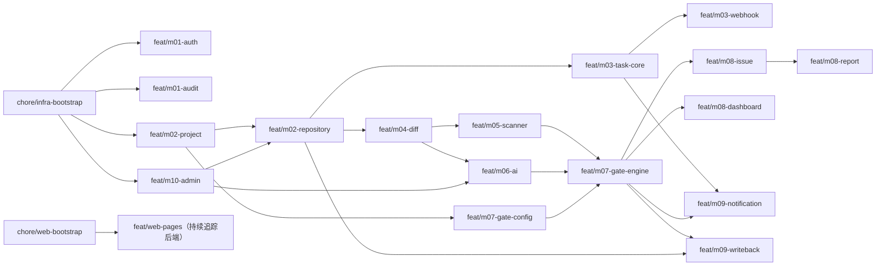

### 20.4 推荐合并顺序与集成测试节点

1. **集成节点 IT-1（批次 0 完成）**：`chore/infra-bootstrap` + `chore/web-bootstrap` → develop。
2. **集成节点 IT-2（批次 1 完成）**：依次合并 `feat/m01-auth` → `feat/m01-audit` → `feat/m02-project` → `feat/m10-admin`。运行登录 / 项目 / 用户接口集成测试。
3. **集成节点 IT-3（批次 2 完成）**：`feat/m02-repository` + `feat/m07-gate-config`。运行仓库连通性 + 门禁规则保存测试。
4. **集成节点 IT-4（评审主链路完成）**：依次合并 `feat/m03-*` → `feat/m04-diff` → `feat/m05-scanner` & `feat/m06-ai`（任一可先）→ `feat/m07-gate-engine`。运行 SD-1 / SD-2 / SD-3 / SD-4 端到端测试。
5. **集成节点 IT-5（报告与外围完成）**：批次 4 全部合并。运行 SD-5（豁免）+ 通知 + 回写测试。
6. **集成节点 IT-6（性能与安全测试）**：在 develop 上跑 k6 报告查询基准（R16.6 / R24.2）+ 越权用例集（R25.5）。
7. **发布**：develop → main，打 tag `v1.0.0`。

### 20.5 共享约定（防止 subagent 撞车）

- 每个 subagent 仅修改自己分支对应的 Java 包与对应的 Vue 页面 / store / api。
- 共享文件（`pom.xml` 依赖、`application.yml` 全局配置、`db/migration` 顺序文件、`router/index.ts`）通过明确的"约定文件 owner"避免冲突；当多个分支需要追加内容时，通过单独的 `chore/wire-<feature>` 集成分支批量合并。
- DDL 增量按 `V{seq}__{module}_{purpose}.sql` 命名（如 `V20__m07_gate_waiver.sql`），不修改既有 V 文件；序号由集成 PR 顺序决定。
- 每条分支必须包含：单元测试（覆盖率 ≥ 70%）、必要的集成测试、CHANGELOG.md 增量。

> Covers: 实施阶段组织约束（不直接覆盖单条需求，但为 R25 "可测试性" 的工程落地提供可执行的并行开发路径）

---

## 附录 A — 设计决策与替代方案对照

| 决策 | 选定 | 替代 | 主要理由 |
|---|---|---|---|
| 状态机实现 | 自实现 State Pattern | Spring StateMachine | 减少依赖与复杂度；状态较少（8 个） |
| 任务队列 | Redis Stream | RabbitMQ / Kafka | 已部署 Redis；零额外组件；满足吞吐 |
| ORM | MyBatis-Plus | Spring Data JPA | 复杂分页与多条件 SQL 更直观；动态 SQL 强 |
| 单模块 vs 多模块 Maven | 单模块 + 包隔离 | Maven 多模块 | MVP 阶段更快；包内单向依赖通过 ArchUnit 守护 |
| JWT 算法 | HS256 | RS256 | 单服务内部场景；密钥派生简单；后续可平滑切换 |
| 异步任务恢复策略 | 启动期标记 EXECUTION_FAILED | XCLAIM 接管继续执行 | 语义最严，符合 R24.4 的"不得永停在中间状态"；策略 B 可作为后续优化 |

---

文档结束。任何后续修改请保持与 `requirements.md` 的需求编号一致，并在每次更新时同步 §18 追溯矩阵。
