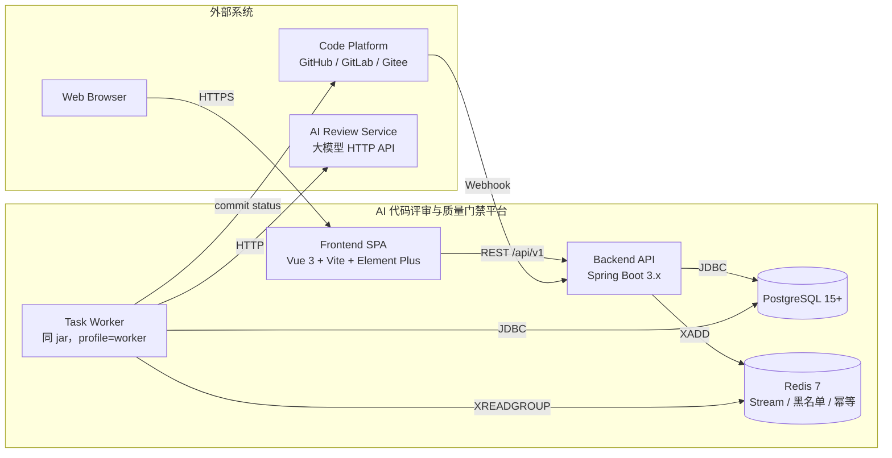

# 架构总览（团队入口）

> 本文档是新成员加入项目时的第一站。它不复述设计细节，而是把读者引导到正确的权威文档（`requirements.md` / `design.md` / `tasks.md`），并提供一份足以"跑起来"的快速上手路径。

---

## 1. 文档导航（Documents）

| 文档 | 作用 | 链接 |
|---|---|---|
| 需求基线 | EARS 形式的 25 条需求（R1~R25），覆盖 M01~M10；任何代码变更必须可回溯到至少一条 R | [requirements.md](../.kiro/specs/ai-code-review-quality-gate-platform/requirements.md) |
| 技术设计 | 容器视图、模块依赖、Java 接口签名、PostgreSQL DDL、状态机、Sequence Diagram、PBT 属性、批次拆分（§20） | [design.md](../.kiro/specs/ai-code-review-quality-gate-platform/design.md) |
| 实现计划 | 6 批次 / 22 条顶层任务（git 分支）/ 约 140 条最叶子任务，含并行执行规则 | [tasks.md](../.kiro/specs/ai-code-review-quality-gate-platform/tasks.md) |
| 接口契约基线 | `/v3/api-docs` 的 oracle，由 B6-A.9 集成验证 diff 校验 | [openapi-baseline.json](./openapi-baseline.json) |
| 变更记录 | 按批次记录交付内容，每条引用 R 编号 | [../CHANGELOG.md](../CHANGELOG.md) |
| 业务原文（参考） | 01 项目需求 / 02 RESTful 接口 / 03 页面原型 / 04 数据库测试部署 | 仓库根目录下的 4 份 `.docx` |

> 当 `requirements.md` 与本文档发生冲突时，以 `requirements.md` 为准；当 `design.md` 与本文档发生冲突时，以 `design.md` 为准。

---

## 2. 系统全景（System at a Glance）

容器视图的简化版（详细版见 [design.md §2.1](../.kiro/specs/ai-code-review-quality-gate-platform/design.md)）：



要点：

- **单 jar、双 profile**：`api` 提供 HTTP，`worker` 监听 Redis Stream。两者共享同一数据源与加密密钥。
- **Worker 水平扩展**：消费组 `review-worker-group` 支持多实例负载均衡，`XCLAIM` 实现中断恢复（R24.4）。
- **单向依赖**：`common` / `infra` 是基础层；M01~M10 业务包按 `design.md §2.3` 单向依赖，禁止反向。

---

## 3. 仓库布局（Repository Layout）

```
AI辅助代码评审与质量门禁平台/
├── .github/workflows/         # CI 流水线（B0-A.12）
├── .kiro/specs/               # 需求 / 设计 / 任务 / 配置（spec workspace）
├── acrqg-platform/            # 后端 Maven 单模块（Spring Boot 3）
│   ├── pom.xml
│   ├── Dockerfile
│   └── src/
│       ├── main/java/com/acrqg/platform/
│       │   ├── AcrqgApplication.java
│       │   ├── common/        # 响应 / 错误码 / 异常 / 工具
│       │   ├── infra/         # JWT / 加密 / Redis / 切面 / Web 配置
│       │   ├── auth user audit project repository
│       │   ├── webhook task diff scanner ai gate
│       │   └── issue report dashboard notification writeback admin
│       └── main/resources/
│           ├── application*.yml
│           ├── db/migration/  # Flyway V{seq}__{module}_{purpose}.sql
│           └── mapper/        # MyBatis-Plus XML
├── acrqg-web/                 # 前端 Vue 3 + Vite + TS（B0-B 起）
├── docs/                      # 团队文档（本目录）
├── docker-compose.yml         # 一键拉起 postgres / redis / backend / worker / nginx
├── .env.example
├── CHANGELOG.md
└── README.md
```

> Migration 文件命名约定：`V{seq}__{module}_{purpose}.sql`。序号区段已在 [tasks.md §并行执行规则](../.kiro/specs/ai-code-review-quality-gate-platform/tasks.md) 中预留：B0=V1~V9，B1=V10~V19，B2=V20~V29，B3=V30~V49，B4=V50~V69。

---

## 4. 分支与集成策略（Branch & Integration Policy）

权威规则见 [tasks.md §并行执行规则](../.kiro/specs/ai-code-review-quality-gate-platform/tasks.md)。摘要：

- **批次内并行**：同批次的顶层任务（如 B1-A / B1-B / B1-C / B1-D）由不同 subagent 在各自 `feat/*` / `chore/*` 分支并行开发。
- **批次间串行**：进入下一批次前，本批次必须全部合入 `develop` 并通过 Integration Node IT-x 验证（端到端冒烟 + 越权用例集 + JaCoCo ≥ 70% + jqwik 属性测试）。
- **共享文件冲突治理**：`pom.xml` 顶层依赖段、`application.yml` 全局段、`router/index.ts`、`stores/index.ts`、Flyway 序号在批次集成 PR `chore/wire-batch-{N}` 中由 reviewer 人工合并。
- **保护分支**：`main` 仅接受来自 `develop` 的 release PR；`develop` 只接受批次集成 PR；功能分支永远基于最新 `develop` 切出。
- **属性测试映射**：8 条 PBT 属性（design §19）已分配到 B1-A / B1-B / B3-A / B3-C / B3-E / B3-F / B4-A，禁止在其它分支重复实现。

---

## 5. 本地快速上手（Local Quickstart）

### 5.1 前置依赖

- JDK 17（推荐 Eclipse Temurin）
- Maven 3.9+
- Node.js 20 LTS（B0-B 之后的前端开发）
- Docker Desktop / Docker Engine + docker compose v2

### 5.2 一键启动整套依赖（推荐）

```bash
cp .env.example .env
docker compose up -d postgres redis
```

这会启动 `postgres:15` 与 `redis:7`，端口分别映射到 `5432` / `6379`。

### 5.3 后端开发循环

```bash
cd acrqg-platform
mvn -B verify                        # 运行单元 + 集成测试 + JaCoCo 覆盖率检查
mvn -pl . spring-boot:run            # 默认 dev + api profile，监听 8080
```

健康检查：

```bash
curl -s http://localhost:8080/health        # 期望 {"status":"UP"}
curl -s http://localhost:8080/v3/api-docs   # OpenAPI 当前 schema（B1+ 起逐步填充）
```

切换到 worker profile（仅消费 Redis Stream，不暴露业务接口）：

```bash
SPRING_PROFILES_ACTIVE=worker,dev mvn -pl . spring-boot:run
```

### 5.4 前端开发循环（B0-B 之后可用）

```bash
cd acrqg-web
npm ci
npm run dev                          # Vite 默认 5173，/api 反代到 :8080
npm run test:unit -- --run           # Vitest 一次性
npm run lint
npm run build
```

### 5.5 整套服务（含 backend / worker / nginx）

```bash
docker compose up -d
docker compose logs -f backend worker
```

停止与清理：

```bash
docker compose down                  # 保留数据卷
docker compose down -v               # 清空 postgres / redis 数据
```

### 5.6 OpenAPI 基线刷新仪式

每次合入新增 `@RestController` 的批次后，由集成 PR 执行：

```bash
docker compose up -d backend
curl -s http://localhost:8080/v3/api-docs | python -m json.tool > docs/openapi-baseline.json
git add docs/openapi-baseline.json
git commit -m "docs(openapi): refresh baseline after B{N} 集成"
```

B6-A.9 会以 `docs/openapi-baseline.json` 为 oracle 与运行期 `/v3/api-docs` 进行 diff 校验（R25.2）。

---

## 6. 常见问题速查

| 现象 | 排查首选 |
|---|---|
| 启动报 `Flyway` 校验失败 | 检查 `db/migration/` 序号段是否冲突；分支合并到 `develop` 前应连续无重号 |
| 响应中出现明文 `apiKey` / `accessToken` | `infra.log.ResponseMaskingAspect` 字段名匹配规则未覆盖；按 R23.3 在切面字段集合中补充 |
| `/auth/me` 返回 401 | JWT 黑名单命中；查 `jwt:bl:jti:{jti}` 是否存在；禁用用户会触发即时拉黑（R3.2） |
| Worker 不消费消息 | `XLEN review-task-stream` 是否为 0；`XINFO GROUPS review-task-stream` 检查消费组与 pending |
| CI 覆盖率门槛失败 | 本地 `mvn -B verify` 后查看 `target/site/jacoco/index.html`；R25.1 要求语句覆盖率 ≥ 70% |

---

## 7. 联系方式与迭代节奏

- 当前阶段：B0 基础设施 Bootstrap（IT-1 集成节点）。
- 下一阶段：B1 独立模块并行（B1-A / B1-B / B1-C / B1-D）。
- 任何文档变更请同步更新 [CHANGELOG.md](../CHANGELOG.md) 中的 `[Unreleased]` 段，并在合并到 `develop` 时归档为新批次小节。
